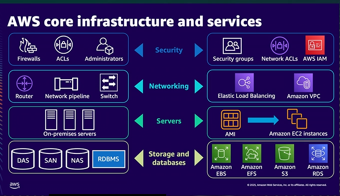
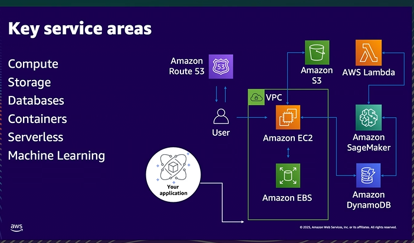
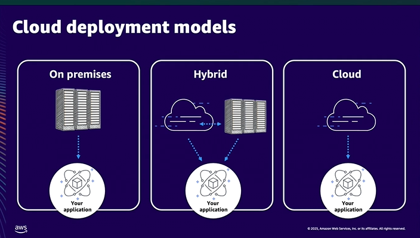

by Peter Vandaele
> #### Six advantages of cloud computing:
>- Trade upfront expense for variable expense
>- Increase speed and agility
>- Benefit from massive economics of scare
>- Stop spending money on running and maintaining data centers
>- Stop guessing capacity
>- Go global in 

#### How to choose the right region?
>- Data residency regulatory compliant
>- Proximity of users to data
>- service and feature availability
>- cost effectiveness

> 

> 

> 

