## Compute
## Amazon Elactis Compute Cloud (Amazon EC2)

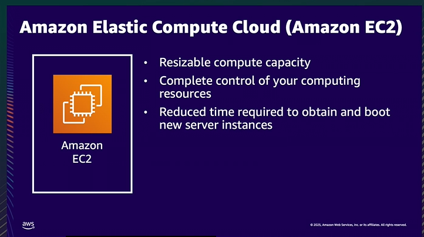

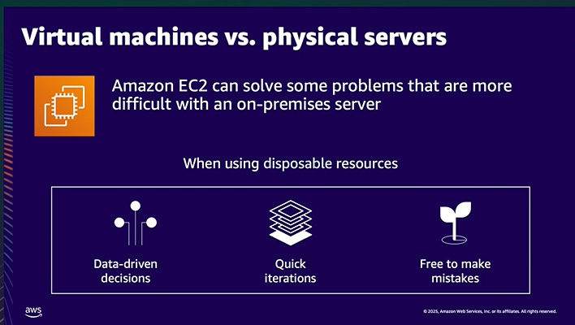

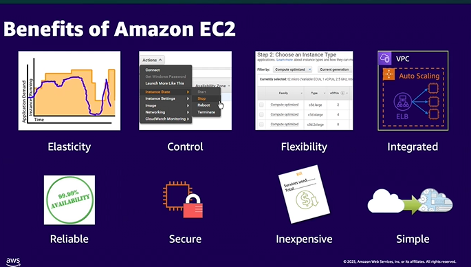

### Benefits of EC2

> - Elasticity
> - Control
> - Flexibility
> - Integrated
> - Reliable
> - Secure
> - Inexpensive
> - Simple

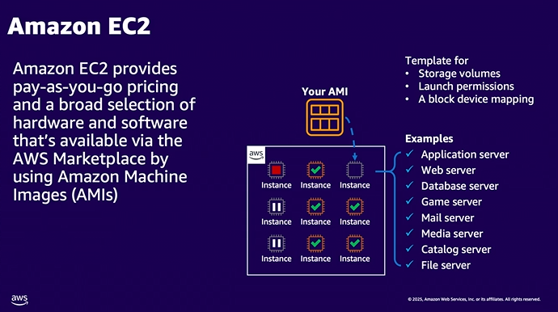

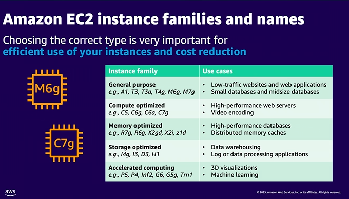

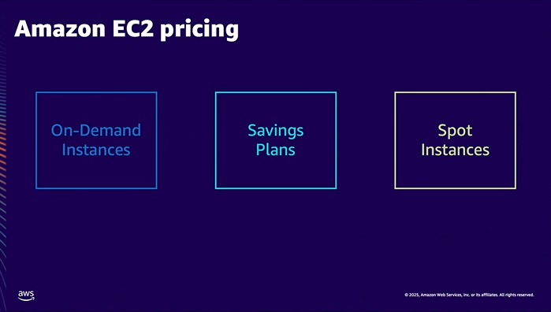

on demand - temporary work loads

savings plans - more permanent workloads

spot instances - prices based on supply on demand

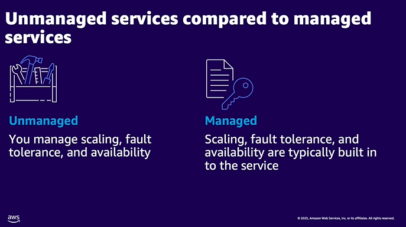
s
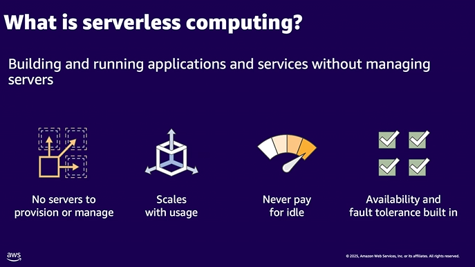

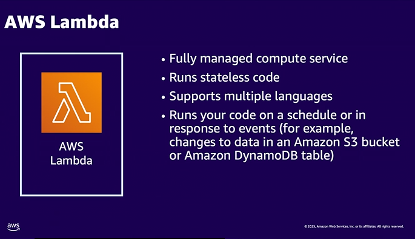

- Lambda can only run for maximum of 15 min

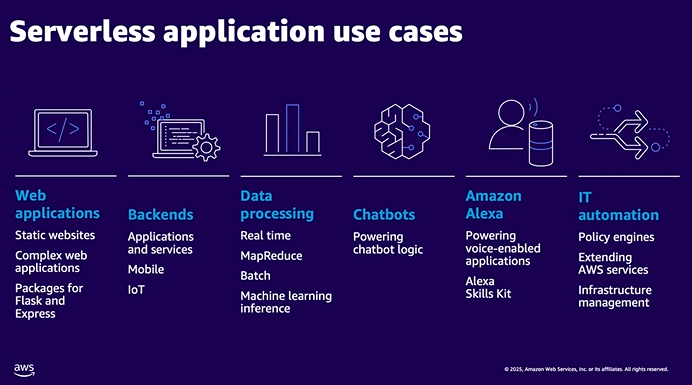

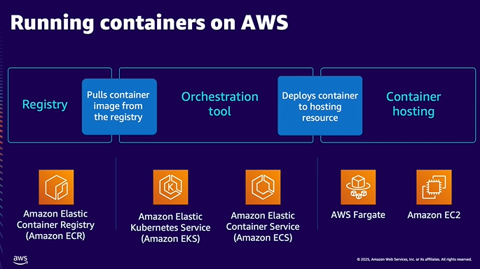

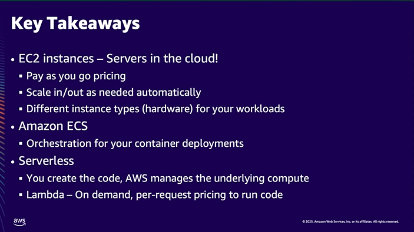

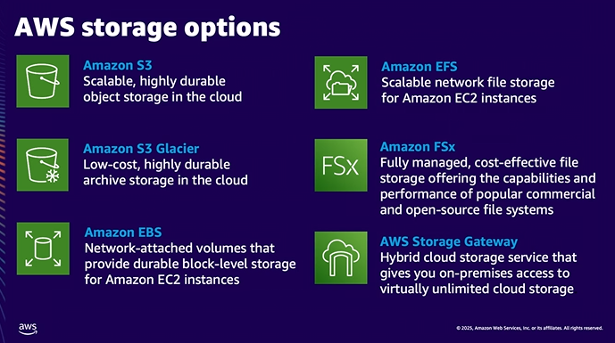

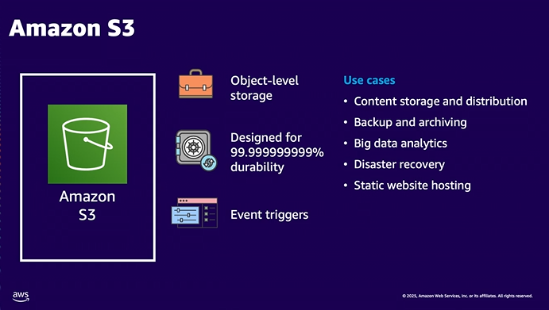

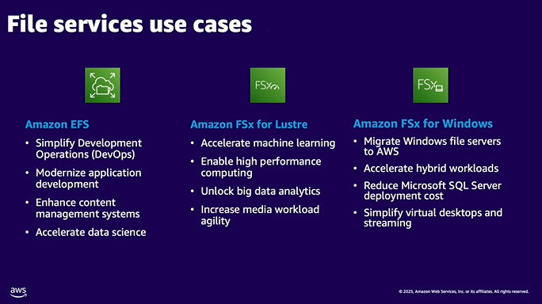

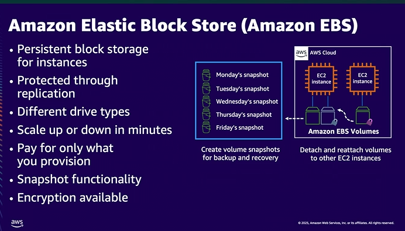

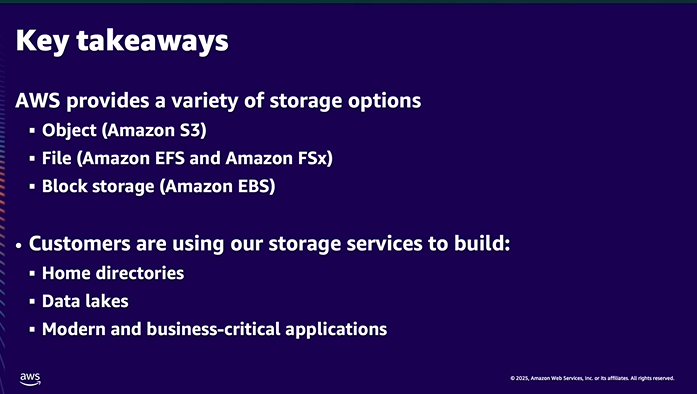

## Databases

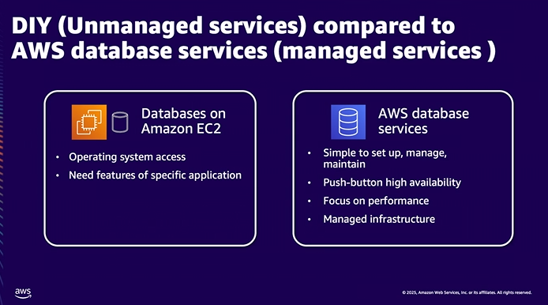

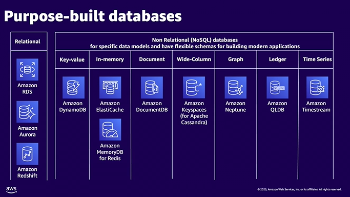

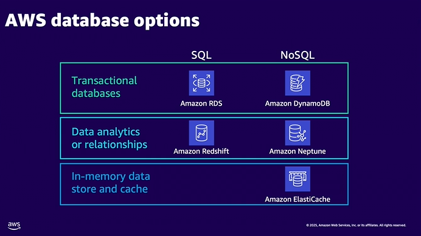

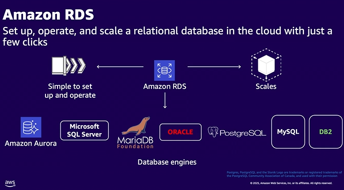

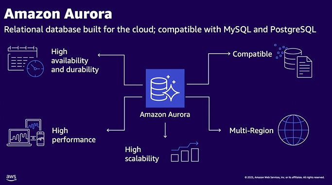

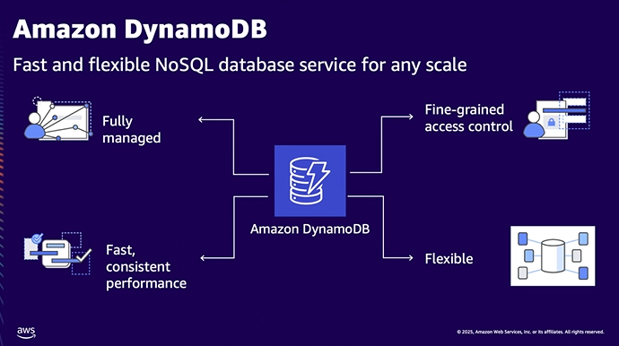

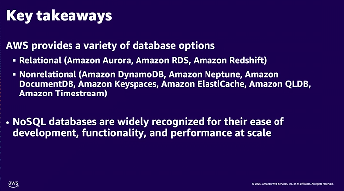