# Innovation with AWS

## Internet of Things

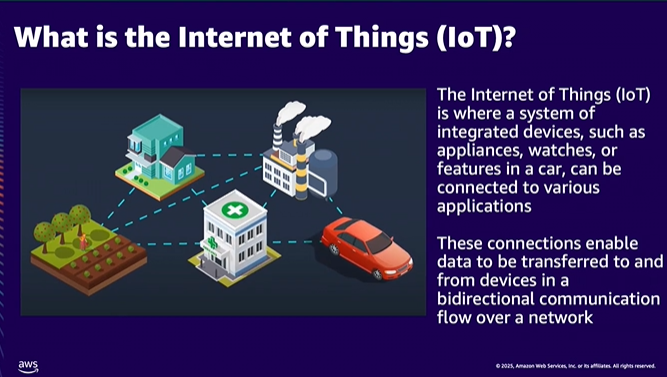

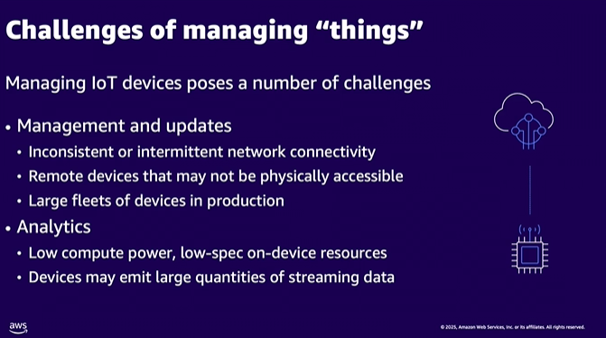

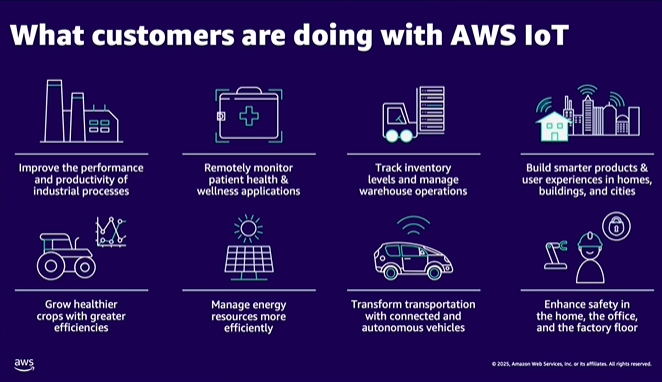

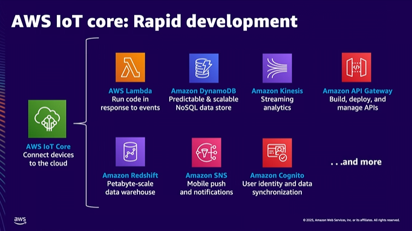

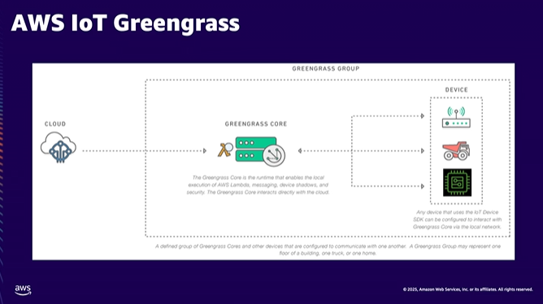

Example of real-world usecase of Greengrass:
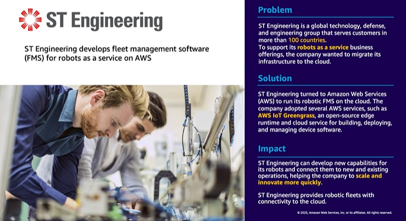

## Machine Learning (ML)

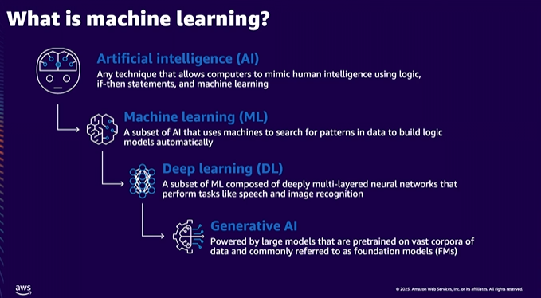

wanna learn basic GenAI? Try out PartyRock based on Amazon BedRock

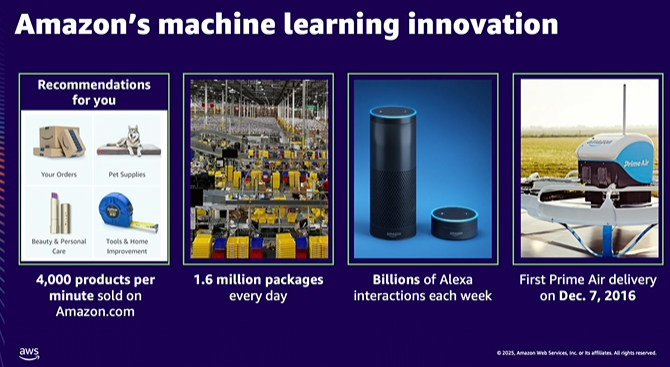

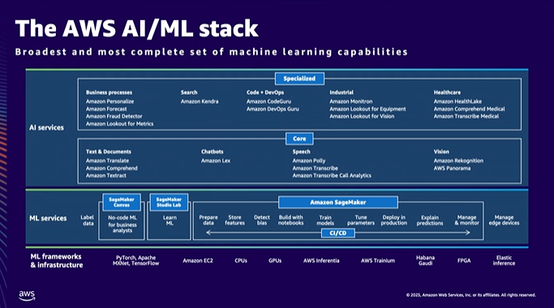

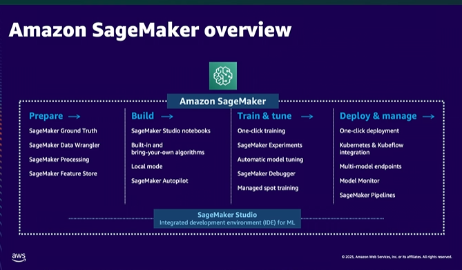

Example of real-world usecase of Sagemaker:
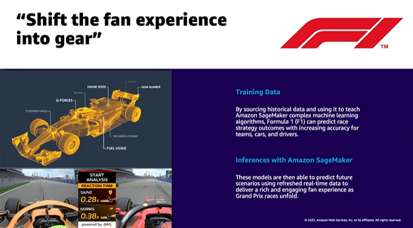

## Blockchain

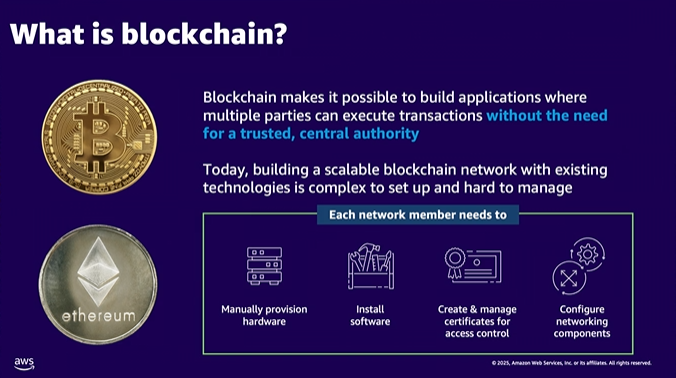

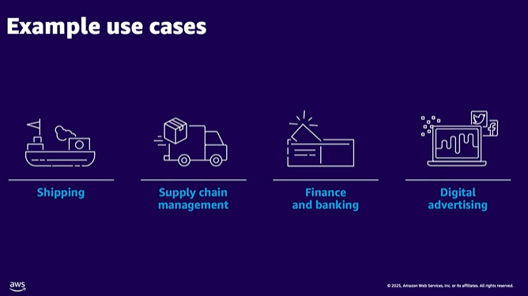

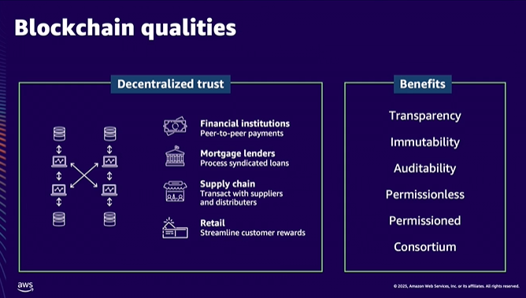

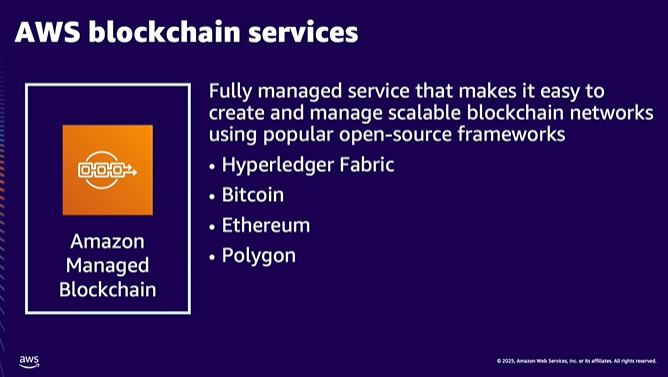

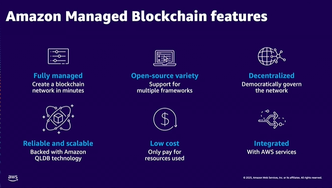

Example of real-world usecase of Amazon Managed Blockchain:
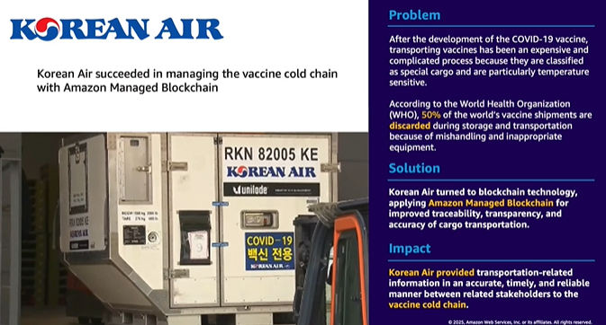

## AWS Ground Station
Use data coming form satellits

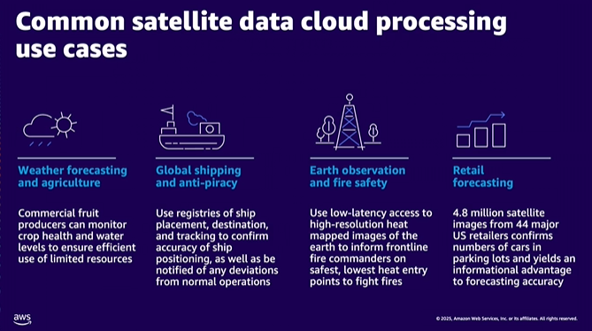

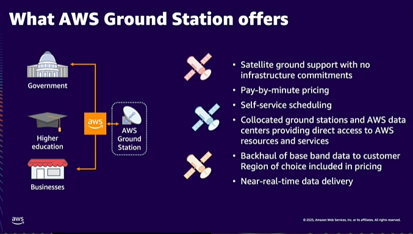

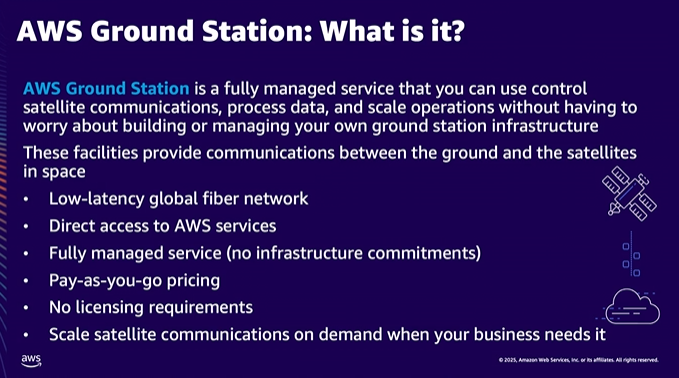

Example of real-world usecase of AWS Ground station:
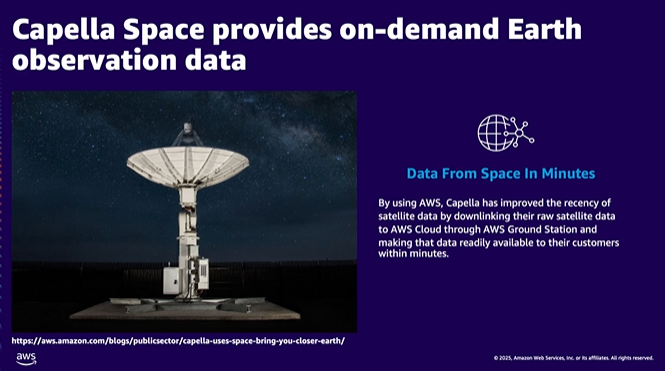

## AWS Wavelength

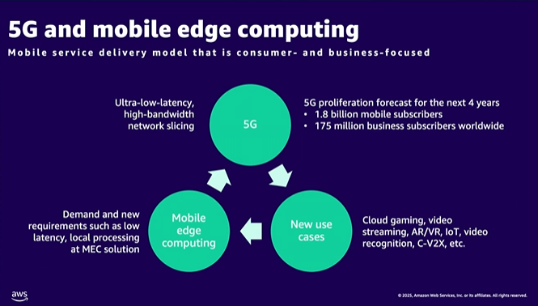

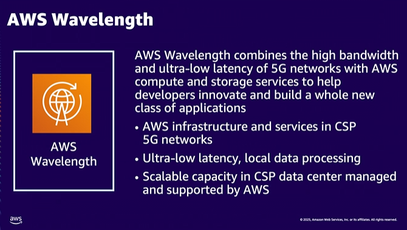

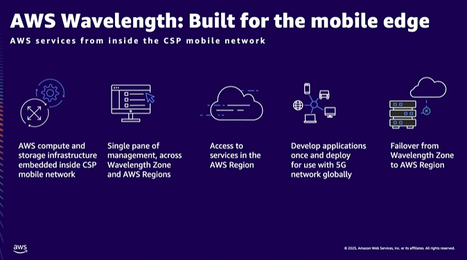

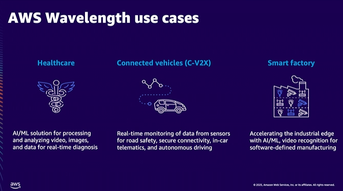

Example of real-world usecase of AWS Wavelength:
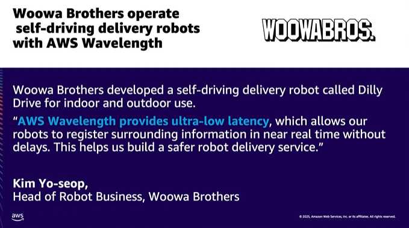

