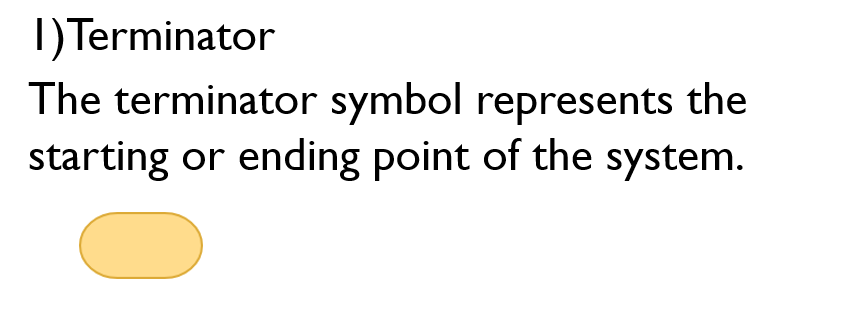

****Please use "Preview" to view contents of the file better**<br>
   To do so, right click on the file and select 'Open Preview' or use the shortcut *ctrl+shift+v*


# Notes
## General Programming
> ### What is a computer program?
>  A program is a set of instructions following rules of the chosen language. Each program is desgined to perform certain task(s).

> ### How is a program executed?
> There are two tools that help with executing a program: <br><br>
> **1. Interpreter:** <br>
 a program that directly executes the instructions in a high-level language, without converting it into machine code <br>
  **2. Compiler:** <br>
  this program converts source code into object code.
  In other words, it convers the program into machine code and then execute. The machine code outputs as a new file. (C uses Compiler)

> ### Keywords
> Keywords are pre-defined terms that the computer recognises. <br> For example, primary data types such as int, char, float etc.

> ### Syntax
> Syntax is basically the structure of how a statement is written to make the program work.

> ### Variable
> A varaible is the name given to memory location that is used to hold certain value/information. <br>


> ### Function
> A function basically is a block of code designed to perform a specific task. <br> Symbolically it is represented as `()` <br>
In C there are two types of functions: the Main function [ `main()` ] and user-defined functions. You will learn more about them under *Structure of C program* later on.


## Algorithm & Flowchart
### <ins>Algorithm
An algorithm is a step-by-step procedure to solve a problem

**General Steps in an algorithm:** <br>
Step 1: Start/begin <br>
Step 2: Declare variables <br>
Step 3: Take input <br>
Step 4: Process/Compute <br> 
Step 5: Show Output <br>
Step 6: End/stop <br>

*<ins>Example: Algorithm for finding sum of two numbers*

Step 1: Start <br>
Step 2: Declare *a,b,sum* <br>
Step 3: read *a,b* <br>
Step 4: Compute *sum = a+b* <br> 
Step 5: Print *sum* <br>
Step 6: Stop <br>

### <ins>Flowchart</ins>
Graphical representation of steps <br> or <br>
Presenting the flow of a sequence/proces using symbols.




*Flowchart Example for adding two numbers* <br>


<ins>*Example algorithm and flowchart for finding greater of two numbers*</ins>

 Algorithm: <br>
> Step 1: Start <br>
 Step 2: Declare *a,b,sum* <br>
Step 3: read *a,b* <br>
Step 4: 
>>Process *If a>b* then <br> 
Print *a* is greater <br>
else <br>
Print *b* is greater <br>

> Step 5: Stop <br>

 Flowchart: <br>
 


# C Programming
> - Developed by Dennis Ritchie in 1972 at bell laboratories of AT&T (American Telephone & Telegraph)
> - It is a structured language (need to follow a set pattern/rules to execute your program)
> - A third Generation programming language (High-level language)

## Variables in C
To declare variables in C we use the following syntax. <br>
Syntax: `<data_type> <variable_name>;` <br>
Example: `int a;`
### Intititalizing a variable
   Initializing means to assign a value to the variable at the time of declaration. This is done by using the `=` (equal-to operator) <br>

   Syntax: `<data_type> <variable_name>=<value>;` <br>
   Example: `int a=10;`
   The variable *a* will now hold the value *10*.


## Data Types in C
 > What is a data type?
 >> Data type refers to the type of value a variable has and what type of mathematical, relational or logical operations can be applied without causing an error. <br> *For example, many programming languages use the data type string to classify text, integer to identify whole numbers and floating point to designate numbers with decimal points.*

In C, data types can be calssified into 3 categories:
- Primitive Data Types
   - These are predefined data types by the language and is referred to by using a reserved keyword.
   You can read about the primitive data types in [this article.](https://www.tutorialspoint.com/what-are-primary-data-types-in-c-language)

- User Defined Data Types
   - The data types defined by the user themself are referred to as user-defined data types. These data types are derived from the existing datatypes.
   There are four different user-defined data types which you read about in [this article.](https://www.geeksforgeeks.org/c-user-defined-data-types/)

- Derived Data Types
   - the data types derived from the primitive or built-in data types are called Derived Data Types. There are three types, you can read about them [here.](https://www.geeksforgeeks.org/c-derived-data-types/)


## Whitespace Characters in C
   - Whitespace is the term used in C to describe blanks, tabs, newline characters and comments. Whitespace separates one part of a statement from another and enables the compiler to identify where one element in a statement, such as int, ends and the next element begins. <br>


For example: <br>
 In the following code line
 ```c
...
   printf("Apples are red.\n Mangoes are yellow"); 
... 
```
'\n' whitespace character is used to go to the next line <br>
In output, the statement will appear as:
```
Apples are red.
Mangoes are yellow.
```
even though both the sentences were typed in the same printf statement without line break.

 ## Format Specifiers in C
 Format specifiers in C are certain special symbols used in the formatted console Input/Output [IO] functions such as `printf()` and `scanf()` <br>
 

 Syntax: `printf("<statement_with_format_specifier>",<variable_names_in_order);` <br>
 Example: <br>
 Say we have a variable *x* which is an integer, we use *%d* format specifier in the following manner <br>
 `printf("%d is an integer",x);` <br>

 > ### Why do we use format specifiers?
 > The computer receives data in a text form, however you may want to parse it in variables of different data types such as int, float or a string. Similarly, the data stored in int, float or char variables has to be sent to the output  in a text format. Format specifier symbols are used exactly for this purpose.

Example Use: Check out the following line of code
```c
...
int x;
x = scanf();
printf("%d is the number you inputed",x);
...
```
The `%d` , integer format specifier, is used to represent the value that variable `x` is holding.

 ## Structure of a C Program
 1. Documentation Section
 2. Preprocessing Section (Link section)
 3. Definition Section (Declaration Section)
 4. Main Function
    - Local Declaration
    - Program Statements
5. User-defined Functions

### 1. Documentation Section
- It contains comments written by the programmer, can contain important information for people who read the code <br>
- Comments can be written in two ways: <br>
   - <ins>Single line:</ins> Single line comments can be written with `//` at the beginning.<br>
   Syntax: `//<enter_comment_here>` <br>
   Example: `//This is a single line comment`
   - <ins>Multiline Comment</ins>: Mutilple line comments are written with `/*` at the beginning and `*/` at the end of the comment <br>
   Syntax: `/*<enter_comment_here>*/` <br>
   Example: `/*This is multi line comment <br> we can add multiple line*/`


### 2. Preprocessing Section (Link section)
   - This section consts of linking the prerequisite header files to execute the program. These header files contain prototype funtions of standard library. 
   - Header files are delcared using pre processing directive `#include` <br>
   Syntax: `#include<header_file_name>;` <br>
   Example: `#include<stdio.h>`

### 3. Definition Section (Declaration Section)
   - Definition section is used to declare symbolic constants <br>
   Example: `#define PI 3.14;` 
   - This is also the global variable (variables that can be used in any user-defined/main function) declaration section. <br>
   Example: `int X;`

   Syntax: `<data_type> <variable_name>;`


### 4. Main Function
   This is the main function from which compilation starts. <br>
   It consists of two parts:
   - Local Declaration <br>
      All local variables are declared here.
   - Program Statements <br>
      All processing/computation steps are written here <br>
   - This section is mandatory for program execution <br>

   Syntax: <br> 
   <code>
   <data_type> main() <br>
   {  <br>
      ... // code to execute<br>
      ...<br>
   } 
   </code>


### 5. Sub-program Section (User-defined Functions)
- The sub-program section contains functions, other than the main function, created by the user. We can create multiple user-defined functions and use in our main function. <br>
- This section is not mandatory for program execution <br>

Syntax:<br> <code>
<data_type> <function_name>() <br>
{  <br>
//function code  <br>
}
</code>  <br>

<ins>C Program Structure Example:</ins>  <br>
```c
// this prorgam displays numbers  // -> Documentation section

#include<stdio.h> // -> Preprocessing Section 

int x=10; // -> declaration section

int main()  // -> main function
{
int a=5; // -> local declaration 
printf("Local variable is %d and Global vairable is %d",a,x); // -> Program statements
return 0;
}
```

### <ins> Hello World Program</ins>  <br>
```c
// The basic program to print 'Hello World'!

#include<stdio.h>

void main() 
{
printf("Hello World");
getch();
}
```

> **Note:** In the above program, you might notice a `;` at the end of almost every line. <br>
 `;` is called <ins>*statement terminator*</ins>, it tells the compiler that the statement ends there and that the comiler should move to next line of code.

> **Note: Predefined functions** <br>
> These are functions that are already defined in the computer. There are many predefined functions which we will learn as we progress, but for now lets know about two mostly used predefinced functions: <br>
> 1. <ins>**printf()** </ins><br>
printf() [read as *print function*] is used to print/display information during the output. <br>
Syntax: `printf("<text_goes_here>");` <br>
Example: `printf("Hello there!");` <br>
Output will be as:
> ```
> Hello there!
> ```
> 2. <ins>**getch()** </ins><br>
The getch() [read as *get character function*] is used towards the end of the program. This function basically asks the computer to wait on the output terminal until the user presses any key. (If you're using vsc, you don't need to use this)

### Few Example Programs implementing what we learnt so far
1. Program showing use of whitespace character

```c
//This program shows use of whitespace character

#include <stdio.h>
void main()
{
   printf("Hello there!\nHave a nice day!");
   getch();
}
```
Output:
```
Hello there!
Have a nice day!
```
2. Program showing use of format specifier

```c
//This program shows use of format specifier
#include <stdio.h>
void main()
{
   float m= 5.53;
   printf("The value stored is %f",m);
   getch();
}
```

# Objectives
On completing this, you should be able to:
- Talk about programming and the language C.
- Identify different data types, whitespace characters, fortmat specifiers and have an idea of how to use them.
- Know the strcture of a C program, and identify each section in a program.
- Write "Hello World" program on your own.

These are essential to be able to understand the next concepts that we explore.
## Tasks 
Few "fun" tasks to practice/implement what you've learnt so far <br>

Based on the above information, <br>
Tasks you should be able to do: 
1. Write/make the algorithm and flowchart for <br>
   a. Subtracting two numbers <br>
   b. Finding least of two numbers

2. Program that prints your name as output
3. Program that makes use of three different whitespace characters
4. Program to display two different data types using two different format specifiers.

Tasks you can try doing:
   1. Program that shows sum of two numbers
