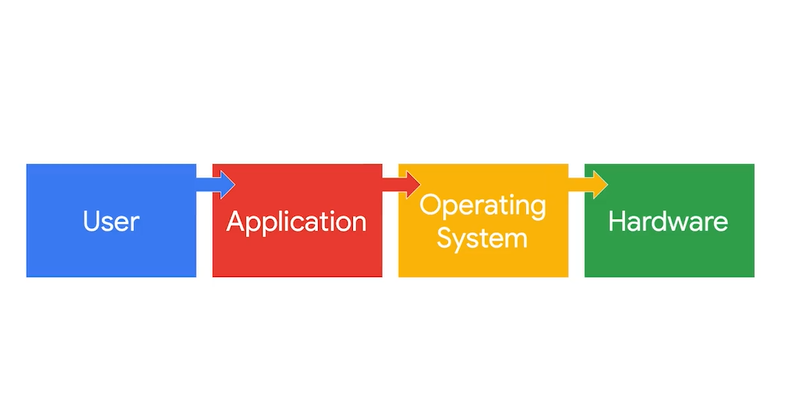
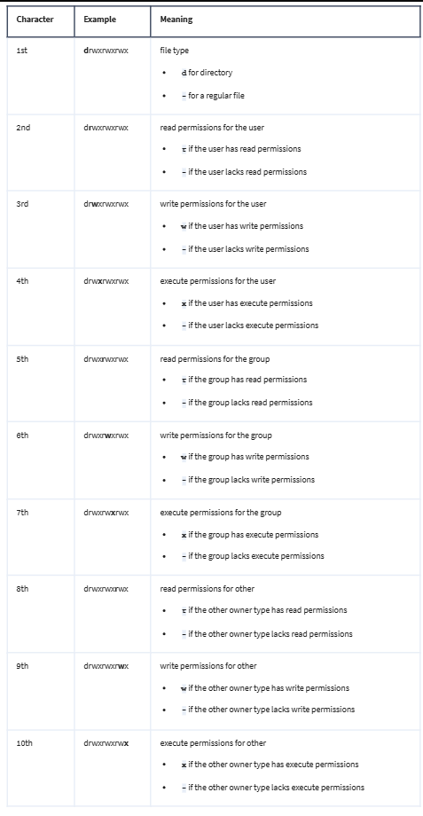
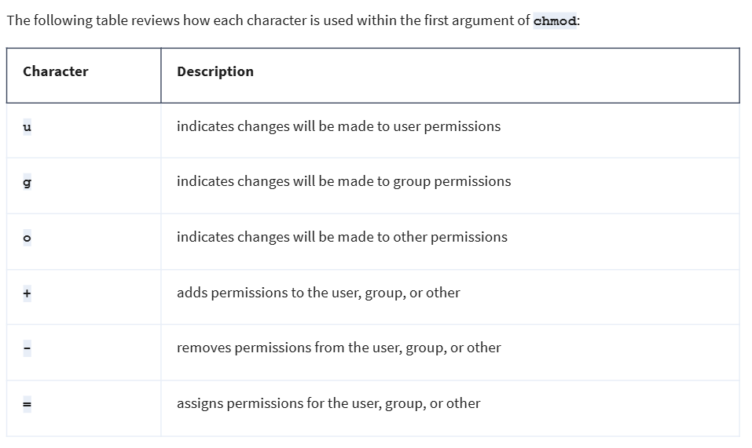
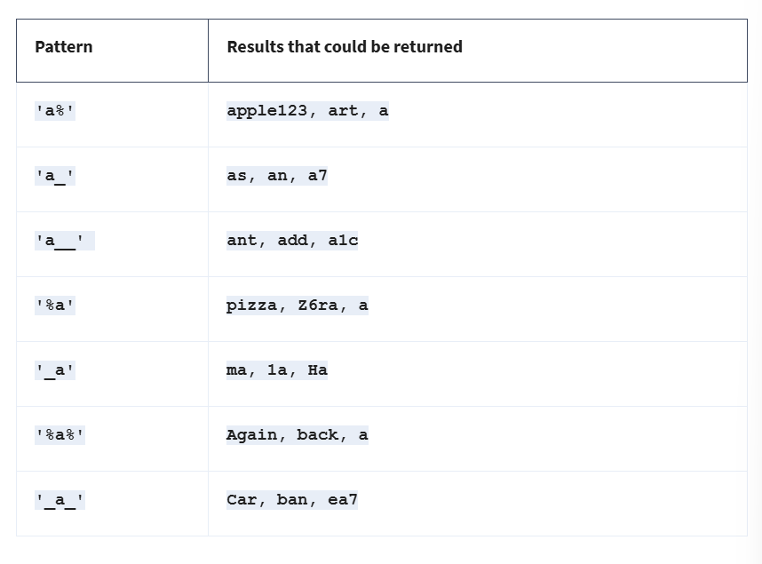
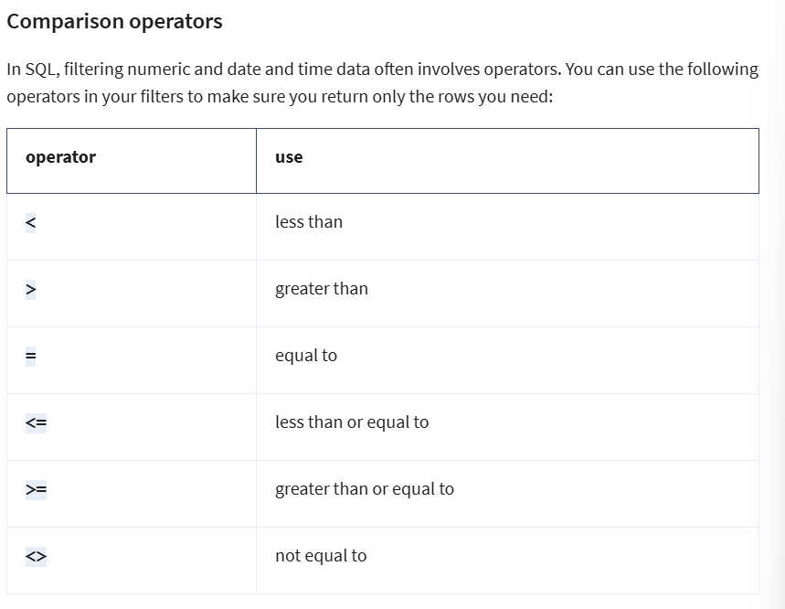
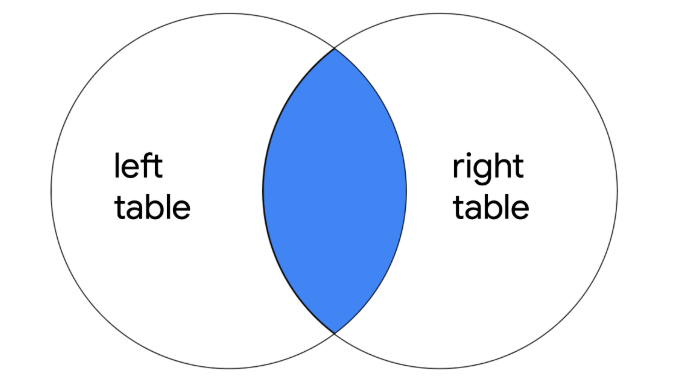
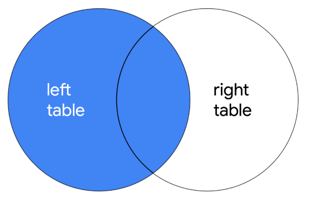
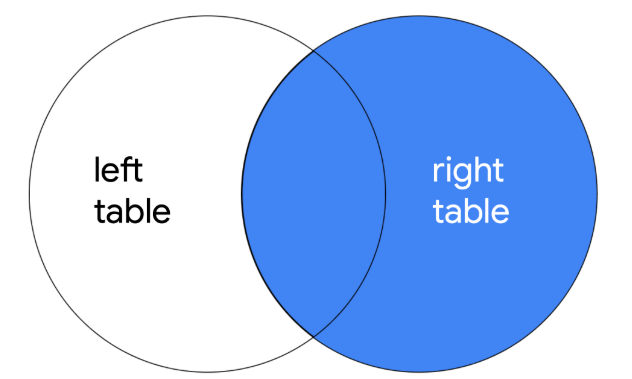
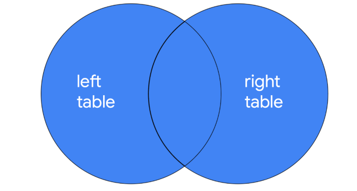

# Module 1 **Introduction To Operating Systems**

> ## Operating System
> Interface between computer hardware and the user

> ## Hardware
> Physical components of a computer

> ## Legacy Operating Systems
> A legacy operating system is an operating system that is outdated but still being used.

> ## Booting the computer
> When you boot, or turn on, your computer, either a BIOS or UEFI microchip is activated. The Basic Input/Output System (BIOS) is a microchip that contains loading instructions for the computer and is prevalent in older systems. The Unified Extensible Firmware Interface (UEFI) is a microchip that contains loading instructions for the computer and replaces BIOS on more modern systems.

> ### Application
> A program that performs a specific task

> ## What is a virtual machine?
> A virtual machine (VM) is a virtual version of a physical computer.   
> The term “virtual” refers to machines that don’t exist physically, but operate like they do because their software simulates physical hardware. Virtual systems don’t use dedicated physical hardware. Instead, they use software-defined versions of the physical hardware. This means that a single virtual machine has a virtual CPU, virtual storage, and other virtual hardware. Virtual systems are just code.

> ### Virtualization
> Virtualization is the process of using software to create virtual representations of various physical machines.

> ## Benefits of Virtual Machines
> - Security
> - Efiiciency

> ### Hypvervisor
>  Virtual machines can be managed with a software called a hypervisor. Hypervisors help users manage multiple virtual machines and connect the virtual and physical hardware. Hypervisors also help with allocating the shared resources of the physical host machine to one or more virtual machines. Ex: Kernel-based Virtual Machine (KVM)

> ### User Interface
> A program that allows the user to control the functions of the operating system

> ## Graphical User Interface (GUI)
> A user interface that uses icons on the screen to manage different tasks on the computer
>> **Basic GUI components**
>> - Start Menu
>> - Task bar
>> - Desktop with icons and shortcuts

> ## Command-line Interface (CLI)
> A text-based user interface that uses commands to interact with the computer 

# Moduel 2 **The Linux Operating System**

> ## Linux
> An open-source operating system

> ## Components of Linux | Linux Architecture
> - **User**  
> The person interacting with the computer 
> - **Applications** 
> A program that performs a specific task
> - **Shell** 
> The command-line interpreter 
> - **Filesystem Hierarchy Standard (FHS)** 
> The component of the Linux OS that organizes data
> - **Kernel** 
> The component of the Linux OS that manages proccesses and memory
> - **Hardware** 
> The physical components of a computer

> ## Distributions
>> Different versions of Linux
>
> ## Parent Distributions
> - Red Hat Enterprise Linux (CentOS)
> - Slackware (SUSE)
> - Debian (Ubuntu and KALI LINUX)
>
> #### Penetration Test
> A simulated attack that helps identify vulnerabilities in systems, networks, websites, applications and processes
>
> ### KALI LINUX
> KALI LINUX ™ is an open-source distribution of Linux that is widely used in the security industry. This is because KALI LINUX ™, which is Debian-based, is pre-installed with many useful tools for penetration testing and digital forensics.
> #### Few Penetration testing tools in Kali Linux
>> - Metasploit
>> - Burp Suite
>> - John the Ripper
>
> #### Digital Forensics
> The practice of collecting and analyzing data to determine what has happened after an attack
>
> #### Digital forensic tools in Kali Linux
>> - tcpdump
>> - Wireshark
>> - Autopsy
>
> ### Ubuntu 
> Ubuntu is an open-source, user-friendly distribution that is widely used in security and other industries. It has both a command-line interface (CLI) and a graphical user interface (GUI). Ubuntu is also Debian-derived and includes common applications by default. 
>
> ### Parrot
> Parrot is an open-source distribution that is commonly used for security. Similar to KALI LINUX ™, Parrot comes with pre-installed tools related to penetration testing and digital forensics.It is based on Debian.
>
> ### Red Hat® Enterprise Linux®
> Red Hat Enterprise Linux is a subscription-based distribution of Linux built for enterprise use. Red Hat is not free, which is a major difference from the previously mentioned distributions. Because it’s built and supported for enterprise use, Red Hat also offers a dedicated support team for customers to call about issues.
>
> ### AlmaLinux
> AlmaLinux is a community-driven Linux distribution that was created as a stable replacement for CentOS. CentOS was an open-source distribution that is closely related to Red Hat, and its final stable release, CentOS 8, was in December 2021. CentOS used source code published by Red Hat to provide a similar platform. AlmaLinux is designed to be a drop-in replacement for CentOS 8. This ensures that applications and configurations that worked on CentOS will continue to function on AlmaLinux. 

> ## Package Manager
> A package is a piece of software that can be combined with other packages to form an application.  
>  A **package manager** is a tool that helps users install, manage, and remove packages or applications. Linux uses multiple package managers. 
>
> Different package managers typically use different file extensions.  For example, *Red Hat Package Manager (RPM)* has files which use the *.rpm* file extension, such as *Package-Version-Release_Architecture.rpm.* Package managers for *Debian-derived Linux distributions*, such as *dpkg*, have files which use the *.deb* file extension, such as *Package_Version-Release_Architecture.deb.*
>
> In addition to package managers like RPM and dpkg, there are also package management tools that allow you to easily work with packages through the shell. Two notable tools are the Advanced Package Tool (APT) and Yellowdog Updater Modified (YUM).
> - **Advanced Package Tool (APT)**  
> APT is a tool used with Debian-derived distributions. It is run from the command-line interface to manage, search, and install packages.
> - **Yellowdog Updater Modified (YUM)**  
> YUM is a tool used with Red Hat-derived distributions. It is run from the command-line interface to manage, search, and install packages. YUM works with .rpm files.

> ## Shell
> The command-line interpreter
>
> #### Command
> An instruction telling the computer to do something
>
> ### Different types of shells
> - Bourne-Again Shell (bash)
> - C Shell (csh)
> - Korn Shell (ksh)
> - Enhanced C shell (tcsh)
> - Z Shell (zsh)
> 
> ### Input and Output in the shell
>
> **- echo**  
> A Linux command that outputs a specified string of text   
> ***String data**: Data Consisting of an ordered sequence of characters*  
>
>> **Standard output:** the respons given by OS throught the shell  
>> **Standard error:** error messages returned by the OS through the shell  

# Module 3 Linux Commands in the Bash Shell

> #### Types of things seccurity analyysts require to do
> - work with server logs
> - Navigate, manage, and analyze files remotely
> - Verify and configure users and group access
> - Give authorization and set file permissions 

**Bash:** Default cell in most linux distributions

> #### Standard FHS directories
> Directly below the root directory, you’ll find standard FHS directories. 
> 
> **/home:** Each user in the system gets their own home directory.  
>
> **/bin:** This directory stands for “binary” and contains binary files and other executables. Executables are files that contain a series of commands a computer needs to follow to run programs and perform other functions. 
>
> **/etc:** This directory stores the system’s configuration files.
>
> **/tmp:** This directory stores many temporary files. The /tmp directory is commonly used by attackers because anyone in the system can modify data in these files.
>
> **/mnt:** This directory stands for “mount” and stores media, such as USB drives and hard drives.

> **<u>TIP:</u>** You can use the ``hier`` command to learn more about the FHS and its standard directories

## Commands in Linux
> #### Directory navigation commands
> - **pwd**  
> Prints the working directory onto the screen
>
> - **ls**
> Displays the names of files and directories in the current working directory
> 
> - **cd**
> Navigates between directories  
> TIP:  You can use the relative file path and enter `cd ..` to go up one level in the file structure.
>
> #### File-related commands
> - **cat**
> Displays conent of a file
>
> - **head**
> Displays just the beginning of a file, by default 10 lines  
> TIP: If you want to change the number of lines returned by head, you can specify the number of lines by including `-n`. For example, if you only want to display the first five lines of the updates.txt file, enter `head -n 5 updates.txt`.
> 
> - **tail**
> This commmand is the opposite of *`head`*. i.e. it is used to display the ennd of a file, by default 10 lines.  
> Note: `tail` is commonly used to read the most recent information in log file
>
> - **less**
> *less* returns the content of a file one page at a time. It changes the terminal window to display the contents of the file, one page at a time. This  allows the user to easily move forward and backward through the content.  
> Once the content is accessed using *`less`*, you can use keyboard to control your movement through the file:  
> *`space bar`*: Moves forward one page  
> *`b`*: Moves back one page  
> *`down arrow`*: moves forward one line  
> *`up arrow`*: moves back one line  
> *`q`*: Quit and retur to previous terminal window  
> 
> #### Other commands:
> - **whoami**
> returns the username of the current user

> ### Filtering commands
>
> - **grep**
> Searches a specified file and returns all lines in the file containing a specified string.  
> Syntax: `grep <string> <file_name>`  
> Example: `grep OS updates.txt`
>
> - **|**(piping)
> Sends the standard output of one command as the standard input to another command for further processing  
> Syntax: ` <first_command> | <second_command>`  
> Example: `ls home/analyst/reports | grep users`
>
> - **find**
> searches for directories and files that meet specified criteria  
> The criteria can be:
>>> - Contain a specific string in the name,
>>> - Are a certain file size, or
>>> - Were last modified within a certain time frame.  
> Syntax: `find <directory|location_to_search> <criteria>`  
>
> *Note: if you don't include a criteria, it will likely return alot of directories and files*
>
>> Specifying criteria involves options. **Options** modify the behaviour of a command and commonly begin with a hyphen (`-`).  
>> **-name and -iname**  
>> These are used to  find file or directory names that contain a specific string. The difference between these two options is that `-name` is case-sensitive, and `-iname` is not. 
>> The specific string you’re searching for must be entered in quotes after the `-name` or `-iname` options.  
> Examples:    `find /home/analyst/projects -name "*log*"`   `find /home/analyst/projects -iname "*log*"`
>
>>_Note: An asterisk (*) is used as a wildcard to represent zero or more unknown characters._
>
>> **-mtime**  
>> This criteria is used when the analyst wants to find files or directories that were modiefied within certain time frame.  
>> The `-mtime` option search is based on days.
> Syntax:
> Examples:   `find /home/analyst/projects -mtime -1`  
`find /home/analyst/projects -mtime +1`  
> where `+1` indicates all files/directories last modified more than one day ago and `-1` indicates all files/directories modified less than one day ago
>
>> ___Note__: The option `-mmin` can be used instead of `-mtime` if you want to base the search on minutes rather than days._

> ### Creating and modifying files/directoris commands
>
> - **mkdir**  
> Creates a new directory  
> Syntax: `mkdir <directory_name>`  
> Example: `mkdir home`  
>
> - **rmdir**  
> Removes a directory. (opposite of mkdir)  
> Syntax: `rmdir <directory_name>`  
> Example: `rmdir home`  
>
> - **touch**  
> Creates a new file  
> Syntax: `touch <file_name_with_extension>`  
> Example: `touch data.txt`  
>
> - **rm**  
> Removes or deletes a file
> Syntax: `rm <file_name_with_extension>`  
> Example: `rm data.txt`  
>
> - **mv**  
> Moves a file/directory to new location.   
> _Note: You must be in directory of the file to move._  
> Syntax: `mv <file_name_with_extension> <location_to_move>`  
> Example: `mv project_info.txt /home/analyst/data`  
>
> - **cp**  
> Copies a file or directory into a new location  
> _Note: You must be in directory of the file to copy._  
> Syntax: `cp <file_name_with_extension> <location_to_copy>`  
> Example: `cp projects.txt /home/analyst/project`  
>
> _**Note**: Use `ls` to check for changes_
>
> - **nano**  
> Nano is a text editor, using nano command will edit the file using text editor.  
> Syntax: `nano <file_name_with_extension>`  
> Example: `nano OS_patches.txt`  
> Editor shortcuts:  
> `CTRL + O` -> save
> `Enter` -> save with current file name
> `CTRL + X` -> exit
>
>> ### Standard output redirection
>> In addition to the pipe (|), you can also use the right angle bracket (>) and double right angle bracket (>>) operators to redirect standard output.  
>> The difference between the two is that `>` overwrites your existing file, and `>>` adds your content to the end of the existing file instead of overwriting it. The > operator should be used carefully, because it’s not easy to recover overwritten files.   
>> *Examples:*  
>> While in a directory containing `permissions.txt`,  
>> -- entering `echo "last updated date" >> permissions.txt` adds the string _"last updated date"_ to the file content.  
>> -- Entering `echo "time" > permissions.txt` overwrites the entire file contents of `permissions.txt` with the string _“time”_.

## File and Directory permissions

> #### Permissions
> The type of access granted for a file or directory
>
> #### Authorization
> The concept of granting access to specific resources in a system
>
> ### Permissions in Linux
> - read (r)
> - write (w)
> - execute (x)
> 
> _Permissions are granted to three different types of owners. They are:_   
> - Users (u)  
> Owner of the file (the user who creates the file is owner by default, but it can be changed)  
> - Group (g)  
> Every user is part of a group. Group is a number of users together.  
> - Other (o)  
> All other users on the system  
>
> Example of how a file with all permissions looks like:  
> `drwxrwxrwx`  
> where  
> `d` - says its a directory, else files have `-`  
> `rwx` [2nd,3rd,4th characters] - says the first type of owner (user) has read(r),write(w),execute(x) permissions  
> `rwx` [5th,6th,7th characters] - says the second type of owner (group) has read(r),write(w),execute(x) permissions  
> `rwx` [8th,9th,10th characters] - says the third type of owner (other) has read(r),write(w),execute(x) permissions  
> If any permission is not allowed, the option is replaced with `-`  
>> For example: *-rwxrw-r--*   Here, the permissions are for a file, with user having read, write, execute, group having read,write and other having only read permissions  
> 
> 
> ## Checking permissions 
> #### Options
> Modify the behavior of the command
>
> ## Permission checking commands
> **`ls -l`**  
> displays permissions to files and directories  
>
> **`ls -a`**  
> displays hidden files  
>
> **`ls -la`**  
> Combination of previous two commands ~ displays permissions to files and directories including hidden files  
>
> ## Changing Permissions
>  
> **chmod**   
> Changes permissions for files and directories. "chmod" is short for changemode. The chmod command requires two arguments. The first argument indicates how to change permissions, and the second argument indicates the file or directory that you want to change permissions for.     
> 
>     
> Syntax: `chmod <owner_type><+/-><permission>, <owner_type2><+/-><permission>, <owner_type3><+/-><permission> <file>`  
> `+` indicates "add"  
> `-` indicated "remove"  
> Example: `chmod g+w, o-r access.txt` 
> Here, we are changing permissions to enable *group* to write (`g+w`) and remove *other*'s read(`o-r`) permission for the file *access.txt*
>  
> 
> 

> ## User Commands
>
> ### Root User (or Superuser)
> A user with elevated privileges to modify the system.
>
> # Problems iwth logging in as root
> - Security risk
> - Easy to make irreversible mistakes
> - Accountability
> 
> One of the solutions for this is the use of:  
> **`sudo`** (super-user do)  
> Temporarily grants elevated permissions to specific users. Users must be given access in a configuration file to use `sudo`. The file is called the "sudoers file".  
>
> **`useradd`** 
> Adds a user to the system. This can only be used by root user or sudo user.  
> Example:  
> To add a user with the username of fgarcia with sudo, enter `sudo useradd fgarcia`. There are additional options you can use with useradd:
>
>>`-g`: Sets the user’s default group, also called their primary group
>
>>`-G`: Adds the user to additional groups, also called supplemental or secondary groups
>
>To use the `-g` option, the primary group must be specified after `-g`. For example, entering `sudo useradd -g security fgarcia` _adds fgarcia as a new user and assigns their primary group to be security._
>
> To use the `-G` option, the supplemental group must be passed into the command after `-G`. _You can add more than one supplemental group at a time with the -G option._ Entering `sudo useradd -G finance,admin fgarcia` adds _fgarcia_ as a new user and adds them to the existing finance and admin groups.  
>
>**`usermod`**  
>The `usermod` command modifies existing user accounts. The same `-g` and `-G` options from the `useradd` command can be used with `usermod` <u> if a user already exists. </u>  
>
>To change the primary group of an existing user, you need the `-g`option. For example, entering `sudo usermod -g executive fgarcia` would change fgarcia’s primary group to the executive group.  
>
>To add a supplemental group for an existing user, you need the `-G` option. You also need a `-a` option, which appends the user to an existing group and is only used with the `-G` option.   For example, entering `sudo usermod -a -G marketing fgarcia` would add the existing fgarcia user to the supplemental marketing group.  
>
>> _**Note**: When changing the supplemental group of an existing user, if you don't include the `-a` option, `-G` will replace any existing supplemental groups with the groups specified after usermod.  Using `-a` with `-G` ensures that the new groups are added but existing groups are not replaced._  
>
> There are other options you can use with usermod to specify how you want to modify the user, including:  
>
>`-d`: Changes the user’s home directory.  
>
>`-l`: Changes the user’s login name.  
>
>`-L`: Locks the account so the user can’t log in.  
>
> The option always goes after the usermod command. For example, to change fgarcia’s home directory to `/home/garcia_f`, enter `sudo usermod -d /home/garcia_f fgarcia`. The option `-d` directly follows the command `usermod` before the other two needed arguments.
>
>**`userdel`**  
> Deletes a user from the system. This requires root user previleges as well.  
> Example:  entering `sudo userdel fgarcia` deletes fgarcia as a user.  
> The `userdel` command doesn’t delete the files in the user’s home directory unless you use the -r option. Entering `sudo userdel -r fgarcia` would delete fgarcia as a user and delete all files in their home directory. Before deleting any user files, you should ensure you have backups in case you need them later.  
>
>> _**Note**: Instead of deleting the user, you could consider deactivating their account with usermod -L. This prevents the user from logging in while still giving you access to their account and associated permissions._
>  
>
> **`chown`**  
> The chown command changes ownership of a file or directory. You can use chown to change user or group ownership.  
> For example: To change the _user owner_ of the _access.txt_ file to fgarcia, enter `sudo chown fgarcia access.txt.` To change the _group owner_ of access.txt to security, enter `sudo chown :security access.txt`. You must enter a colon (:) before security to designate it as a group name.   
>
> - Similar to useradd, usermod, and userdel, there are additional options that can be used with chown.

> ## Resources available in the shell
> Linux has built-in commands for support/information.  
>
> **`man`**: (short for manual) 
> This command displays information on other commands and how they work.
>  
>**`whatis`**:  
> Displays a description of a command on a single line  
>
> **`apropos`**:  
> Searches the manual page decription for a specified string  

# Module 4 **Databases & SQL**
>
> ## Databases
> An organized collection of information or data  
> - Accessed by multiple people simultaneously
> - Store massive amounts of data
> - Perform complex tasks while accessing data
>
> ## Relational database
> A structured database containing tables that are related to each other  
> ## Primary key
> A column where every row has a unique entry
>
> ## Foregin key
> A column in a table that is primary key in another table
>
>> _**Note**: A table can have one primary key but multiple foregin keys_
>
> ## SQL (Structured Query Language)
> A programming language used to create, interact with, and request information from a database.
>
> ### Query
> A request for daata from a tabase table or a combination of tables
>
> ### Log 
> A record of event that occurs within an organisation's systems
>
> ## Accessing SQL in Linux
> To access SQL from Linux, you need to type in a command for the version of SQL that you want to use. For example, if you want to access SQLite, you can enter the command `sqlite3` in the command line.

> ## SQL Queries
> 
> #### Syntax
> The rules that determine whaat is correctly structured in a computing language  
>
> ### SQL Keywords
>
> **SELECT**  
> Indicates which columns to return  
>   
> 
> **FROM**  
> Indicates which table to query. The `SELECT` keyword always comes with the `FROM` keyword.   
>
> Syntax: `SELECT <column_name> FROM <table_name>;`  
> Example: `SELECT employee_id, device_id FROM employees;` 
> This displays the employee_id and device_id rows from the table "employees'.  
>
>> _**Note**: `*` refers to all the data in the table (in this case)_
>
> **ORDER BY**  
> `ORDER BY` sequences the records returned by a query based on a specified column or columns. This can be in either ascending or descending order.  
> 
> Syntax: `SELECT <column_name> FROM <table_name> ORDER BY <column_name;`  
> Example: `SELECT customerid, city, country FROM customers ORDER BY city;`  
> This will return the _customerid, city, and country_ columns from the _customers_ table, and the records will be sequenced by the _city_ column.  
>
> The `ORDER BY` keyword sorts the records based on the column specified after this keyword. By default, as shown in this example, the sequence will be in ascending order. This means:
> - if you choose a column containing numeric data, it sorts the output from the smallest to largest. For example, if sorting on customerid, the ID numbers are sorted from smallest to largest.
> - if the column contains alphabetic characters, such as in the example with the city column, it orders the records from the beginning of the alphabet to the end.
>
> ### Sorting in descending order
>
> To sort in descending order, we use the keyword `DESC` after mentioning the column after `ORDER BY`.
>
> For example:  
> `SELECT customerid, city, country FROM customers ORDER BY city DESC;`
>
> ### Sorting based on multiple columns
> Sorting can be done with multiple columns as well.  
> For example, you might first choose the _country_ and then the _city_ column. SQL then sorts the output by country, and for rows with the same country, it sorts them based on city. 
> Query example: `SELECT customerid, city, country FROM customers ORDER BY country, city;`
>
>
> ## Filtering
> Selecting data that matche a certain condition
>
> #### Operator
> a symbol or keyword taht represents an operation 
>
> **WHERE**
> indicates a condition for a filter. After using keyword `WHERE` the condition is listed using operators.  
> Example: `SELECT customerid, city, country FROM customers WHERE country = 'USA';`  
>
>
> ### Filtering for patterns
> Filtering can also be done based on patterns, ot requires two elements:
> - a wildcard
> - the `LIKE` operator
>
> - **Wildcards**
>A wildcard is a special character that can be substituted with any other character. Two of the most useful wildcards are the percentage sign (%) and the underscore (_):
>> - The percentage sign substitutes for any number of other characters. 
>> - The underscore symbol only substitutes for one other character.  
> These wildcards can be placed after a string, before a string, or in both locations depending on the pattern you’re filtering for.  
> The following table includes these wildcards applied to the string 'a' and examples of what each pattern would return.  
> 
> 
> - **The `LIKE` Operator**  
> To apply wildcards to the filter, you need to use the LIKE operator instead of an equals sign (=). LIKE is used with WHERE to search for a pattern in a column.   
>For instance, if you want to email employees with a title of either 'IT Staff' or 'IT Manager', you can use LIKE operator combined with the % wildcard:   
> Query: `SELECT lastname, firstname, title, email FROM employees WHERE title LIKE 'IT%';`  
> This query returns all records with values in the title column that start with the pattern of 'IT'. This means both 'IT Staff' and 'IT Manager' are returned.  
> 
> As another example, if you want to search through the invoices table to find all customers located in states with an abbreviation of 'NY', 'NV', 'NS' or 'NT', you can use the 'N_' pattern on the state column:  
> Query: `SELECT firstname,lastname, state, country FROM customers WHERE state LIKE 'N_';`
>  
> This returns all the records with state abbreviations that follow this pattern.

> ## Common Data types in Databases
>
> - ### String
> Data consisting of ordered sequence of characters. They could be numbers, letters or symbols.
>
> - ### Numeric
> Data consisting of numbers. Unlike string, mathematical symbols can be used on numeric data.
>
> - ### Date and Time 
> Data representing date and/or time.
>
> #### Operators used with Numeric and Date and time data types
> 
_>> **Note**: You can also use != as an alternative operator for not equal to._  
>
> **BETWEEN**  
> An operator that filters for numbers or dates within a range  
> Syntax: `.... BETWEEN <beginning_of_range> AND <end_of_range>;`  
>> _**Note**: Numberical data types don't need quotaion marks_  
>
> 
> 
> ### Logical Operators
> **AND**  
> Specifies that both conditions must be met simultaneously  
>
> **OR**  
> Specifies that either condition can be met  
>
> **NOT**  
> Negates a condition  
>
> Logical operators can be combined in filters. For example, if you know that both the USA and Canada are not affected by a cybersecurity issue, you can combine operators to return customers in all countries besides these two. In the following query, NOT is placed before the first condition, it's joined to a second condition with AND, and then NOT is also placed before that second condition.  
> Example Query: `SELECT firstname, lastname, email, country FROM customers WHERE NOT country = 'Canada' AND NOT country = 'USA';`  
>
>> _**Pro tip**: Another way of finding values that are not equal to a certain value is by using the <> operator or the != operator. For example, WHERE country <> 'USA' and WHERE country != 'USA' are the same filters as WHERE NOT country = 'USA'._

> ## Joining Tables in Database
>
> **INNER JOIN**  
>  Returns rows matching on a specific column that exists in more than one table.  
>   
>
> Syntax: `SELECT <table1_columns> FROM <table1> INNER JOIN <table_2> ON <table1>.<matching_column> = <table2>.<matching_column>` 
> Example: `SELECT * FROM employees INNER JOIN machines ON employees.device_id = machines.device_id;`  
>
> **OUTER JOIN**  
>
>  Has three types:  
>
> - LEFT JOIN  
> Returns all the records of the first table, but only returns rows of the second table that match on a specified column  
> 
> > Syntax: `SELECT <table1_columns> FROM <table1> LEFT JOIN <table_2> ON <table1>.<matching_column> = <table2>.<matching_column>` 
> - RIGHT JOIN  
> Returns all the records of the second table, but only returns the rows from the first table that match on specified column 
> 
> > Syntax: `SELECT <table1_columns> FROM <table1> RIGHT JOIN <table_2> ON <table1>.<matching_column> = <table2>.<matching_column>` 
> - FULL OUTER JOIN  
> Returns all records from both tables
> 
> > Syntax: `SELECT <table1_columns> FROM <table1> FULL OUTER JOIN <table_2> ON <table1>.<matching_column> = <table2>.<matching_column>` 

> ## Aggregate Funcitons
> These are functions that perform a calculation over multiple data points and return the result of the calculation. The actual data is not returned. 
>
>There are various aggregate functions that perform different calculations:
>
> - **COUNT**:   returns a single number that represents the number of rows returned from your query.  
>
> - **AVG**:   returns a single number that represents the average of the numerical data in a column.  
>
> - **SUM**:   returns a single number that represents the sum of the numerical data in a column.  
>