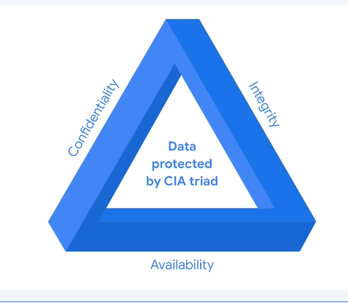
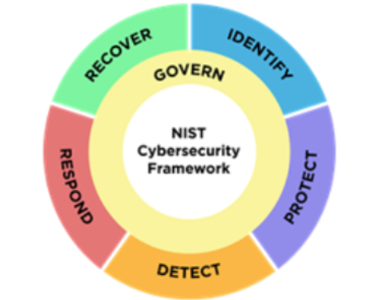

# Module 1

## Part 1: CISSP Security Domains

1. Security and Risk Management
   Focused on defining security goals and objectives, risk mitigation, compliance, business continuity, and legal regulations

   - Security goals and objectives
     Helps in reducing risks for critical assets or data like PII
   - Risk Mitigation
     Process of having the right procedures and rules in place to quickly reduce the impact of a risk like a breach.
   - Compliance
     Primary method used to develop organisation's security policies, regulatory requirements and independent standards
   - Business Continuity
     Ability to maintian everyday productivity by establishing risk disaster recovery plans
   - Legal Regulations
     Laws related to security and risk management worldwide

2. Asset Security
   Focused on digitial and physical assets. Also related to storage, maintenance, retetntion, and destruction of data.

3. Security Architecture and Engineering
   Optimizing data security by ensuring effective tools, systems and processes are in place to protact an organisation's assets and data

   - Shared responsibility:
     All individuals in an org take an active role in lowering risk and maintaining both physical/virtual security

4. Communications and Network Security
   FOcused on managaing and securing physical networks and wireless communications. (whether on site, in cloud or remote).

## Part 2: CISSP Security Domains

5. Identity and Access Management
   Focused on access and authorization to keep data secure, by making sure users follow establisehd policies to control and manage assets
   OR
   Responsibility to reduce overall risk to systems and data

   Four components:

   - Identification (Identifying user with username/access card/biometric)
   - Authentication (Verification process to prove identity using password/pin)
   - Authorization ( Rleates to level of access based on role in org)
   - Accountabilty (refers to monitoring and recording user actions to prove system and data are used properly [like logs])

6. Security Assessment and Testing
   Focuses on security control testing, collecting and analyzing data, and conducting security audits ot monitor for risks, threats and vulnerabilities.

7. Security Operations
   Focused on conducting investigations and implementing preventative measures

8. Software development security
   Focuses on using secure coding practices.

## National Institute of Standards and Technology - Risk Management Framework (NIST RMF)

Seven Steps:

    1. Prepare
        activities that are necessary to manage security and privacy risks before a breach occurs

    2. Categorize
        Used to develop risk management processes and tasks

    3. Select
        Choose, customize & capture documentation of the controls that protect an organization

    4. Implement
        Implement security and privacy plans for the organisation

    5. Assess
        Determine if established controls are implmented correctly

    6. Authorize
        Being accountable for the security and privacy risks that may exist in an organisation

    7. Monitor
        Be aware of how systems are operating

# Module 2

    Security Frameworks:

     Guidelines used for building plans to help mitiage risk and threats to data and privacy

## Security Controls:

    Safeguards designed to reduce specific security risks

    - Encryption
        Process of converting data from readable format to encoded format
            Plain text -> Cipher Text

    - Authentication
         Process of identifying who someone or something is.
         Ex: Multifactor Authentication
            Vishing:
                The exploitation of electronic voice communication to
                obtian sensitive information or to impersonate a known
                source

    - Authorization:
            The concept of granting access to specific resources within a
            system

## CIA triad:

        A model that helps inform how organisations conisder risk when setting up systems and security policies

        - Confidentiality:
            Only authorized users can access speicif assets or data
        - Integrity:
            The data is correct, authentic and reliable.
        - Availability:
            Data is accessible to those who are authorised to access it

## NIST CyberSecurity Framework

A voluntary framework that consists of standards, guidelines, and best practices to manage cybersecurity risk

    Six Core Functions:
        - Govern
            Emphasizes the impoertance of strong cybersecurity governance across all levels of organization.

        - Identify
            The management of cybersecurity risk and its effect on an organization's people and assets

        - Protect
            The Strategy used to protect an organization through the implementation of policies, procedures, training, and tools that help mitigate cybersecurity threats.

        - Detect
            Identifying potential security incidents and improiving monitoring capabilities to increase the speed and efficency of detections

        - Respond
            Making sure that the proper procedures are used to contain, neutralize, and analyze security incidents and implement improvements to the security process

        - Recover
            Process of returing the affected systems back to normal operation

    NIST S.P.800-53 (S.P. ~ Special Publication)
     A unified framework for protecting the security of information systems within the federal government

## Open Web Application Security Project (OWSP)

    Security Principles:
    - Minimize attack surface areas.
        Attack surface refers to all the potentila vulnerabilities a threat actor could exploit
    - Principe if least privilege:
        Users have the least amount of access required to perform their everyday tasks.
    - Defence in depth:
        Organizations should have varying security controls that mitigate risks.
    - Seperation of duties:
        Critical actions should rely on multiple people, each of whom follow the principle of least privilege.
    - Keep Security Simple:
        Avoid unnecessarily complicated solutions. Complexity makes security difficult.
    - Fix security issues connrectly:
        When security indidnets occur, identify the root cause, contain the impact, identify vulnerabilities, and conduct tests to ensure that remediation is successful.

### Additional OWASP Security Principles:
    Establish secure defaults:
        OPtimal security state of an application is also its default state for users; it should take extra work to make the application insecure.
    Fail Securely:
        Fail securely means that when a control fails or stops, it should do so by defaulting to its most secure option.
        For example, when a firewall fails it should simply close all connections and block all new ones, rather than start accepting everything.
    Don't Trust Services:
        Many organizations work with third=party partnets. These outside partners often have different security policies than the org does. And the organizaiton shouldn't explicitly trust that their partners' systems are secure.
        For example: if a thirs-party vendor tracks reward points for airline customers, the airline should ensure that the balance is accurate before sharing that information with the customers. 
    
    Avoid Security by obscurity:
        The security of an application should not rely on keeping the source code secret. Its security should rely upon many other factors, including reasonable password policies, defence in depth, business transaction limits, solid network architecture and fraud and audit controls.

 ### Security audit
    A review of an organization's security controls,policies, and procedures against a set of expectations.
    Two types: Internal and External.
    Internal Audit is controlled by a team of people (including manager)
    - Internal Security Audits Purpose:
        - Identify Organizational risk
        - Assess controls
        - Correct compliance issues
    - Common elements of Internal Audits:
        - Establishing the scope and goals
            Scope refers to the specific criteria of an internal security audit. Identify, people, assets, policies, procedures and technoligies that improve security posture.
            Goals are an outline of the organization's security objectives.
        - Conducting a risk assessment
            Identifying potential threats, risks and vulnerabilities. Helps in knocning what security measures need to be taken.
        - Completing a controls assessment
            Control Categories:
                - Administrative controls.
                - Technical Controls. (hardware and software controls)
                - Physical controls. (like cameras and locks)
        - Assessing compliance
        - Communicating results 
            Communicate the chnages to stakeholders.
            - Summarizes scope and goals
            - Lists existing risks
            - Notes how quickly those risks need to be addressed
            - Identifies compliacne regulations
            - Provides Recommendations

# Module 3

  ### Logs
        Record of an event

        Sources:
            - Firewall log
                is a record of attempted or established connections for incoming traffic from the internet. It also includes outbound requests to the internet from withing the network.
            - Network
                is a record fo all computers and devices that enter and leave the network. It also records connections between devices and services on the network.
            - Server 
                is a record of events related to services, such as webites, emails, or file shares. It includes actionss such as login, passowrd and username requests. 

 ### Security Information and Event Management (SIEM)
        An application that collects and analyzes log data to monitor critical activities in an organization.

        Metrics:
            Key technical attributes, such as response time, availability, and failure rate, which are used to assess the performance of a software application.
        
        Security orchestration, automation, and response (SOAR):
             is a collection of applications, tools, and workflows that uses automation to respond to security events

   ## SIEM Tools
        - Self-hosted
        - Cloud-hosted 
        - Hybrid (both self and cloud)
            Ex: Splunk Enterprise, Splunk Cloud
    
   ### Examples of Commonly used SIEM tools
    Splunk
        is an data analysis platform
        - Splunk Enterprise:
            A self -hosted tool used to retain, analyze, and search an organization's log data to provide security information and alerts in real-time.
        - Splunk Cloud:
            A cloud-hosted tool used to collect,search and monitor log data. Works for hybrid orgs
        - Chronicle (by Google)
            Cloud-native tool used to reatin, analyze and search data.
    
    Cloud native tools:
        SImilar to cloud-hosted tools, maintained and managed by vendor. But specifically designed to take full advantage of cloud. (availability, flexibility, scalability)

   ### More CS tools:
        - Open-source tools:
            THese are often free, and are user friendly.
            The objective of open-source tools is to provide users with software that is built by the public in a collaborative way, which can result in the software being more secure.
            Example: Linux, Suricata.
            
        - Proprietary tools:
            Proprietary tools are developed and owned by a person or company, and users typically pay a fee for usage and training. The owners of proprietary tools are the only ones who can access and modify the source code.
            Examples: Splunk, Chronicle.

# Module 4
   ### Playbook
            A manual that provides details about any operational action.

   ### Incident Respone
        An organization's quick attempt to identify an attack, contain the damage and correct the effects of a security breach.

   ### Incident Respone playbook phases
        - Preparation
            documenting procedures, establishing staffing plans, educating users.
        - Detectiong and Analysis
            Detect and analyze events using defined proccesses and technology.
        - Containment
            prvenet further damage and reduce immediate impact of security incident.
        - Eradication and Recovery (IT Resoration)
            Removal of incidents artifcats for organisation to return to normal function.
        - Post incident activity
            Documenting the incident, informing leadership, applying lessons learnt to make sure organisation is ready if incident occurs again.
        - Coordination
            recording incidents and sharing informaation based on org's established standards. 
        
        Playbooks can be used for:
            - Open atttacks
            - Privacy Incidents
            - Data leaks
            - Denial Of Service attaks
            - Service alerts
            - Others

   ## Playbooks & SIEM Tools
        Playbooks are generally used alongside SIEM tools. If, for example, unusual user behavior is flagged by a SIEM tool, a playbook provides analysts with instructions about how to address the issue. 
   ## Playbooks & SOAR Tools
         For example, if a user attempts to log into their computer too many times with the wrong password, a SOAR would automatically block their account to stop a possible intrusion. Then, analysts would refer to a playbook to take steps to resolve the issue.
    