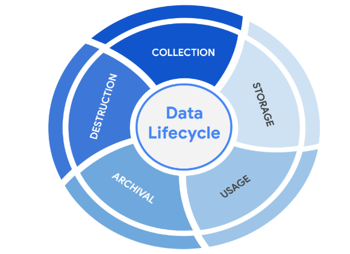
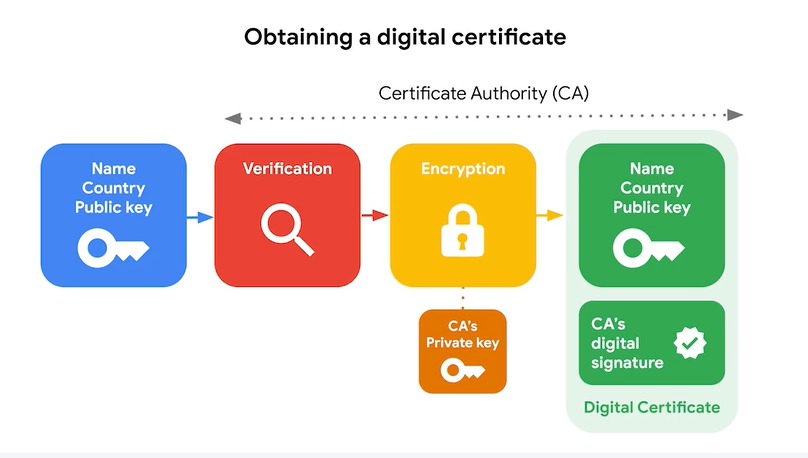
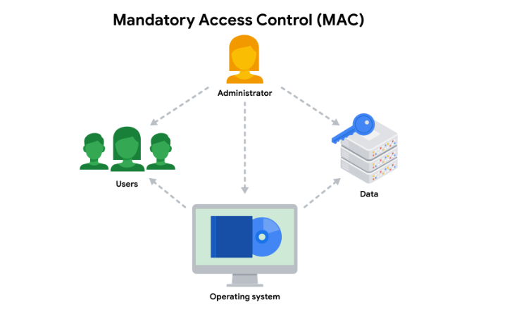
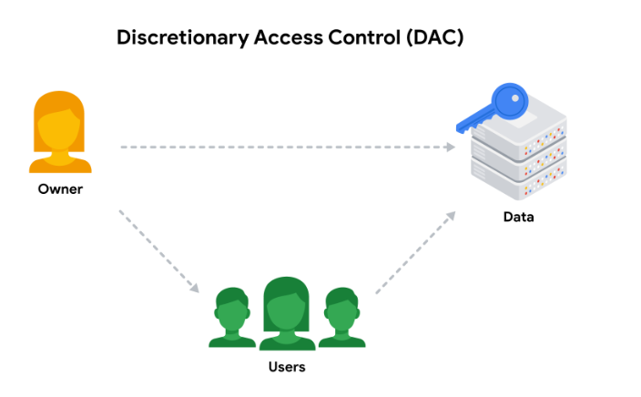
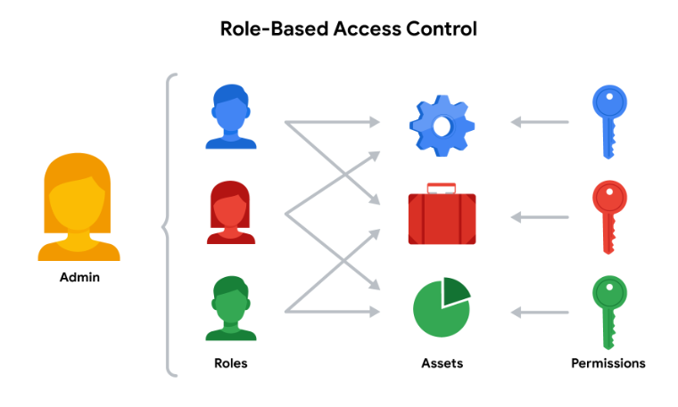
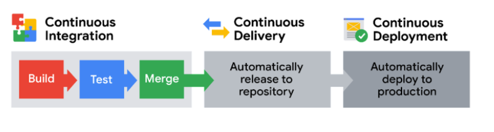
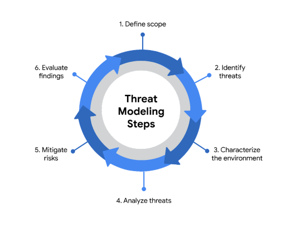

# Course 5 Assets, Threats and Vulnerabilities

# Module 1
>
> ## Risk
> Anything that can impact the confidentiality, integrity or availabilty of an asset
>
> ## Security risk planning
> - Assets:  
> An item percrived as having value to an organisation  
> - Threats:  
> Any circumstance or event that can negatively impact assets  
> - Vulnerabilities:  
> A weakness that can be exploted by a thread  
>
> ## Asset Management
> The process of tracking assets and the risks that affect them
>
> ## Asset Inventory
> A catalog of assets that need to be protected
>
> ## Asset Classification
> The practice of labelling assets based on sensitivity and importance to an organisation
>
> ## Level of asset classification
> - **Public** is the lowest level of classification. These assets have no negative consequences to the organization if they’re released.
> - **Internal-only** describes assets that are available to employees and business partners.
> - **Confidential** refers to assets whose disclosure may lead to a significant negative impact on an organization.
> - **Restricted** is the highest level. This category is reserved for incredibly sensitive assets,  like need-to-know information.
>
>
> ## Data
> Information that is translated, processed, or stored by a computer
>
> ## States of Data
> - **In use**  
> Data that is being accessed by one or more users
>
> - **Data in transit**  
> Data travelling from one point to another
>
> - **Data at rest**  
> Data not currently being accessed
>
> ## Information Security (InfoSec)
> The practice of keeping data in all states away from unauthorized users.
>
> ## Types of risk categories
> - Damage
> - Disclosure
> - Loss of information

> ## Elements of a security plan
> - Policies  
> A set of rules that reduces risk and protects information  
> - Standards  
> References that inform how to set policies  
> - Procedures  
> Step-by-step instructions to perform a specific security task

> ## Compliance
> The process of adhering to internal standards and external regulations
>
> ## Regulations
> Rules set by a government or other authority to control theh way something else is done
>
> ## NIST Cybersecurity Framework (CSF)
> A voluntary framework that consists of standards, guidelines, and best practices to manage cybersecurity risk
>
> ### NIST CSF Components
>> 1. **Core**  
>>> #### Five functions of the NIST CSF core
>>> - Identify
>>> - Protect
>>> - Detect
>>> - Respond
>>> - Recover
>> 2. **Tiers**
>>> The CSF tiers are a way of measuring the sophistication of an organization's cybersecurity program. CSF tiers are measured on a scale of 1 to 4. Tier 1 is the lowest score, indicating that a limited set of security controls have been implemented. Overall, CSF tiers are used to assess an organization's security posture and identify areas for improvement. 
>> 3. **Profiles**
>>> The CSF profiles are pre-made templates of the NIST CSF that are developed by a team of industry experts. CSF profiles are tailored to address the specific risks of an organization or industry. They are used to help organizations develop a baseline for their cybersecurity plans, or as a way of comparing their current cybersecurity posture to a specific industry standard.

# Module 2
> 
> ## Security Controls
> Safeguards designed to reduce specific security risks 
>
> ### Types of security controls
>> - Technical  
>> - Operational  
>> - Managerial  
>
> ## Information privacy
> The protection of unauthorized access and distribution of data
>
> ## Principle of least privilege
> The concept of granting only the minimal access and authorization required to complete a task or function
>
> ## Data Owner
> The person that describes who can access, edit, use or destroy their information
>
> ## Data custodian
> Anyone or anything that is responsible for the safe handling, transport and storage of information.
>
> ## Determining access and authorization.
> To implement least privilage, access and authorization should be determined first. Determining can be done by asking two questions:
> - Who is the user?  
> - How much access do they need to a specific resource?  
>
>A user can refer to a person, like a customer, an employee, or a vendor. It can also refer to a device or software that's connected to your business network. In general, every user should have their own account. Accounts are typically stored and managed within an organization's directory service. 
>> _These are the most common types of user accounts:_
>>
>> **Guest accounts** are provided to external users who need to access an internal network, like customers, clients, contractors, or business partners.
>>
>> **User accounts** are assigned to staff based on their job duties.
>>
>> **Service accounts** are granted to applications or software that needs to interact with other software on the network.
>>
>> **Privileged accounts** have elevated permissions or administrative access.
>>
> It's best practice to determine a baseline access level for each account type before implementing least privilege. However, the appropriate access level can change from one moment to the next.
>
> ## Auditing account privileges
> Setting up the right user accounts and assigning them the appropriate privileges is a helpful first step. Periodically auditing those accounts is a key part of keeping your company’s systems secure.
>
> There are three common approaches to auditing user accounts:
>
>- Usage audits
>
>- Privilege audits
>
>- Account change audits
>
>- As a security professional, you might be involved with any of these processes.
>
> #### Usage audits
>When conducting a usage audit, the security team will review which resources each account is accessing and what the user is doing with the resource. Usage audits can help determine whether users are acting in accordance with an organization’s security policies. They can also help identify whether a user has permissions that can be revoked because they are no longer being used.
>
> #### Privilege audits
> Users tend to accumulate more access privileges than they need over time, an issue known as privilege creep. This might occur if an employee receives a promotion or switches teams and their job duties change. Privilege audits assess whether a user's role is in alignment with the resources they have access to.
>
> #### Account change audits
> Account directory services keep records and logs associated with each user. Changes to an account are usually saved and can be used to audit the directory for suspicious activity, like multiple attempts to change an account password. Performing account change audits helps to ensure that all account changes are made by authorized users.
>
> _**Note:** Most directory services can be configured to alert system administrators of suspicious activity._

> ## The Data Lifecycle
> The data lifecycle is an important model that security teams consider when protecting information. It influences how they set policies that align with business objectives. It also plays an important role in the technologies security teams use to make information accessible.
>
> In general, the data lifecycle has five stages:
>- Collect
>- Store
>- Use
>- Archive
>- Destroy
> 
>
> ## Data governance
> Data governance is a set of processes that define how an organization manages information. Governance often includes policies that specify how to keep data private, accurate, available, and secure throughout its lifecycle.
>
> Data governance policies commonly categorize individuals into a specific role:  
>
> **Data owner:** the person that decides who can access, edit, use, or destroy their information.  
> 
> **Data custodian:** anyone or anything that's responsible for the safe handling, transport, and storage of information.  
> 
> **Data steward:** the person or group that maintains and implements data governance policies set by an organization.  
>
> ### Information privacy 
> Refers to the protection of unauthorized access and distribution of data.
> ### Information security (InfoSec)
>  Refers to the practice of keeping data in all states away from unauthorized users.
>
> ## Regulations
> They  are rules set by a government or another authority to control the way something is done.
> Three of the most influential industry regulations that every security professional should know about are:
>
>- #### General Data Protection Regulation (GDPR)
> GDPR is a set of rules and regulations developed by the European Union (EU) that puts data owners in total control of their personal information. Under GDPR, types of personal information include a person's name, address, phone number, financial information, and medical information.
>
> The GDPR applies to any business that handles the data of EU citizens or residents, regardless of where that business operates. For example, a US based company that handles the data of EU visitors to their website is subject to the GDPRs provisions.
>
>- #### Payment Card Industry Data Security Standard (PCI DSS)
> PCI DSS is a set of security standards formed by major organizations in the financial industry. This regulation aims to secure credit and debit card transactions against data theft and fraud.
>
>- #### Health Insurance Portability and Accountability Act (HIPAA) 
> HIPAA is a U.S. law that requires the protection of sensitive patient health information. HIPAA prohibits the disclosure of a person's medical information without their knowledge and consent.
>
> ## Security Assessments and Audits
>
> **Security audit** is a review of an organization's security controls, policies, and procedures against a set of expectations.
>
>**Security assessment** is a check to determine how resilient current security implementations are against threats.

> ## Fundamentals of Cryptography
> ### Personally Identifiable Information (PII)
> Any information that can be used to infer an individual's identity
>
> ### Cyrptography
> The process of transforming information into a form that unintended readers can't understand
>
> ### Algoritgh
> A set of rules that solve a porblem
>
> ### Cipher
> An algorithm that encrypts information
>
> ### Cryptographic key
> A mechanism that decrypts ciphertext
>
> ### Brute Force Attack
> A trial and error process of discovering private information
>
> ## Public Key Infrastructure (PKI)
> An encryption framework that secures the exchange of inormation online
>
> ### Public Key Infrastructure Process
> Two step process
>> 1. Exchange of encrypted information
>> Involves asymmetric encryption, symmetric encryption or both.
>>> - **Asymmetric encrpyption**: The use of public and private key pair for ecryption and decryption of data.
>>> - **Symmetric encryption**: The use of a single secret key to excahneg information
>> 2. Establish trust using a system of digital certificates
>>> **Digital certificate** is a file that verifies the identitiy of a public key holder.
>>> 
>
> ### Approved algorithms
>Many web applications use a combination of symmetric and asymmetric encryption. This is how they balance user experience with safeguarding information. As an analyst, you should be aware of the most widely-used algorithms.
>
> #### - Symmetric algorithms
>> **Triple DES (3DES)** is known as a block cipher because of the way it converts plaintext into ciphertext in “blocks.” Its origins trace back to the Data Encryption Standard (DES), which was developed in the early 1970s. DES was one of the earliest symmetric encryption algorithms that generated 64-bit keys, although only 56 bits are used for encryption. A bit is the smallest unit of data measurement on a computer. As you might imagine, Triple DES generates keys that are three times as long. Triple DES applies the DES algorithm three times, using three different 56-bit keys. This results in an effective key length of 168 bits. Despite the longer keys, many organizations are moving away from using Triple DES due to limitations on the amount of data that can be encrypted. However, Triple DES is likely to remain in use for backwards compatibility purposes.   
>
>> **Advanced Encryption Standard (AES)** is one of the most secure symmetric algorithms today. AES generates keys that are 128, 192, or 256 bits. Cryptographic keys of this size are considered to be safe from brute force attacks. It’s estimated that brute forcing an AES 128-bit key could take a modern computer billions of years!
>
> ####  - Asymmetric algorithms
>> **Rivest Shamir Adleman (RSA)** is named after its three creators who developed it while at the Massachusetts Institute of Technology (MIT). RSA is one of the first asymmetric encryption algorithms that produces a public and private key pair. Asymmetric algorithms like RSA produce even longer key lengths. In part, this is due to the fact that these functions are creating two keys. RSA key sizes are 1,024, 2,048, or 4,096 bits. RSA is mainly used to protect highly sensitive data.
>
>> **Digital Signature Algorithm (DSA)** is a standard asymmetric algorithm that was introduced by NIST in the early 1990s. DSA also generates key lengths of 2,048 bits. This algorithm is widely used today as a complement to RSA in public key infrastructure.

> ## Hash Function
> An algorithm that produces a code that can't be decrypted.
>
> ### Non-repudiation
> The concept that the autenticiy of information can't be denied
>
> ### Rainbow tables
> A rainbow table is a file of pre-generated hash values and their associated plaintext. 
> ### Next-generation hashing
> To avoid the risk of hash collisions, functions that generated longer values were needed. MD5's shortcomings gave way to a new group of functions known as the Secure Hashing Algorithms, or SHAs.
>
>The National Institute of Standards and Technology (NIST) approves each of these algorithms. Numbers besides each SHA function indicate the size of its hash value in bits. Except for SHA-1, which produces a 160-bit digest, these algorithms are considered to be collision-resistant. However, that doesn’t make them invulnerable to other exploits.
>
>> Five functions make up the SHA family of algorithms:
>>
>> - SHA-1
>> - SHA-224
>> - SHA-256
>> - SHA-384
>> - SHA-512
>
> ### Salting
> Salting is an additional safeguard that's used to strengthen hash functions. A salt is a random string of characters that's added to data before it's hashed. The additional characters produce a more unique hash value, making salted data resilient to rainbow table attacks.  
> _For example, a database containing passwords might have several hashed entries for the password "password." If those passwords were all salted, each entry would be completely different. That means an attacker using a rainbow table would be unable to find matching values for "password" in the database._

> ## Access Controls
> Security controls that manage access, authorization, and accountability of information.
>
> ### AAA Framework
>
> 1. #### Authentication
>> ##### Factors of Authentication
>> 1. **Knowledge:** something the user knows (password/answer to security question)
>> 2. **Ownership:** something the user possesses (OTP via email/sms)
>> 3. **Characteristic:** something the user is (biometrics)
>
> > #### Single sign-on (SSO)
> A technology that combines several different logins into one
>
> #### Multi-factor authentication (MFA)
> A security measure which requires a user to verify their identity in two or more ways to acceess a system or network. In other words, it uses two different factors of authentication to authenticate the user.
>
> 2. #### Authorization
> Authorization uses Principle of Least Privilege along with Seperation of Duties to authorize a user.
> ##### Seperation Of Duties
> The principle that users should not be given levels of authorization that would allow them to misuse a system  
> To commonly seen authorization tools:
>> - ##### Basic Auth
> This is used by HTTP, it is the technology used to establish a user's request to access a server.
>
>>> - **OAuth:**
> An open-standard authorization protocol that shares designated access between applications
>
>>> - **API Token:**
> A  small block of encrypted code that contains infomration about a user
> 
> 3. #### Accounting
> Accounting is the practice of monitoring the access logs of a system.
>
> ##### Session
> A sequence of network HTTP basic auth requests and responses associated with the same user
>
>_Access logs are essentially records of sessions from when a user starts a session until the leave it_  
>
> Two actions take place when a session begins. They are:
> 1. **Creation of session ID**:  
> A unique token taht identifies a user and thier device while accessing the system. They are attached to the user until they close the browser or the session time runs out.
> 2. **Exchange of session cookies between server and user's device**:  
> Session cookie is a token that websites use to validate a session and determine how long that session should last.
>
> #### Session Hijacking
> An event when attackers obtain a legitimate user's session ID.
>
> ### Identity and access management (IAM)
> dentity and access management (IAM) is a collection of processes and technologies that helps organizations manage digital identities in their environment. Both AAA and IAM systems are designed to authenticate users, determine their access privileges, and track their activities within a system.
>
> Either model used by your organization is more than a single, clearly defined system. They each consist of a collection of security controls that ensure the right user is granted access to the right resources at the right time and for the right reasons. Each of those four factors is determined by your organization's policies and processes.
>
> In IAM, Authenticating users is the same as in AAA. i.e, they use
> - Knowledge (something the user knows)
> - Ownership (something the user posssesses)
> - Characteristic (something the user is)
> to authenticate users.
>
> #### User provisioning
> User provisioning is the process of creating and maintaining a user's digital identity.   For example, a college might create a new user account when a new instructor is hired. The new account will be configured to provide access to instructor-only resources while they are teaching. 
>
> #### Granting authorization
If the right user has been authenticated, the network should ensure the right resources are made available. There are three common frameworks that organizations use to handle this step of IAM:
>
>> ##### Mandatory access control (MAC)
>> 
>> MAC is the strictest of the three frameworks. Authorization in this model is based on a strict need-to-know basis. Access to information must be granted manually by a central authority or system administrator. For example, MAC is commonly applied in law enforcement, military, and other government agencies where users must request access through a chain of command. MAC is also known as non-discretionary control because access isn’t given at the discretion of the data owner.
>
>>  ##### Discretionary access control (DAC)
>> 
>> DAC is typically applied when a data owner decides appropriate levels of access. One example of DAC is when the owner of a Google Drive folder shares editor, viewer, or commentor access with someone else.
>
>>  ##### Role-based access control (RBAC)
>> 
>> RBAC is used when authorization is determined by a user's role within an organization. For example, a user in the marketing department may have access to user analytics but not network administration.
>

# Module 3 Vulnerabilities
>
>  ## Vulnerability
> A weakness that can be exploited by an threat
>
> ## Exploit
> A way of taking advantage of a vulnerability
>
> ## Vulnerability Management
> The process of finding and patching vulnerabilities
>   It consists of four steps:  
> 1. Identify vulnerabilities
> 2. Consider potential exploits
> 3. Prepare defenses against threats
> 4. Evaluate those defenses
> 
> ### Zero-day
> An exploit that was previously unknown
>
> ## CI/CD piplelines
> Continuous Integration, Continuous Delivery, and Continuous Deployment (CI/CD) pipelines are essential for modern software development. They help teams deliver software faster and more efficiently. But, like any powerful tool, CI/CD pipelines can also introduce security risks if not properly managed.  
> _CI/CD automates the entire software release process_, from code creation to deployment. This automation is what enables modern development teams to be agile and respond quickly to user needs. Let's break down the key parts:
> 
> - ### Continuous Integration (CI): Building a Solid Foundation
> Continuous Integration (CI) is all about frequently merging code changes from different developers into a central location. This triggers automated processes like building the software and running tests. CI catches problems through an automated process: every time code is integrated, the system automatically builds and tests it. This immediate feedback loop reveals integration problems as soon as they occur. CI helps catch integration problems early, leading to higher quality code. Think of it as the foundation of the pipeline.
>
> - ### Continuous Delivery (CD): Ready to Release
> Continuous Delivery means your code is always ready to be released to users. After passing automated tests, code is automatically deployed to a staging environment (a practice environment) or prepared for final release. Typically, a manual approval step is still needed before going live to production, which provides a control point.
>
> - ### Continuous Deployment (CD): Fully Automated Releases
Continuous Deployment automates the entire release process. Changes that pass all automated checks are automatically deployed directly to the live production environment, with no manual approval. This is all about speed and efficiency.
>
> ## Defence in Depth (aka Castle Approach)
> A layered approach to vulnerability management 
>
> ### Defence in Depth Strategy
> 1. Perimeter Layer [Authentication layer that filters external access]
> 2. Network Layer [made up of technologies like firewall and others, closer to authorization]
> 3. Endpoint Layer [Endpoints are devices in the network, some technlogoies that protect these devices are anti-virus]
> 4. Application Layer [his includes all the interfaces that are used to interact with technology. At this layer, security measures are programmed as part of an application. One common example is multi-factor authentication.]
> 5. Data Layer [The critical data. One security control that is important here in this final layer of defense is asset classification.]

> ## Common Vulnerabilities and Exposures list (CVE list)
> An openly accessible disctionary of known vulnerabilities and exposures
>
> ### MITRE 
> A collection of non-profit research and development centers
>
> ### CVE Numbering Authority (CNA)
> An organizaition that volunterrs to analyze and distribute information on eligible CVEs
> 
> ### CVE list Criteria
> 1. Independent of other issues
> 2. Recognised as a potential security risk
> 3. Submitted with supporting evidence
> 4. Only affect one codebase
>
> ### Common VUlnerability Scoring System (CVSS)
> A measurement system that scores the severity of a vulnerability
>

> ## Open web Application Security Project (OWASP)
> OWASP is a nonprofit foundation that works to improve the security of software. OWASP is an open platform that security professionals from around the world use to share information, tools, and events that are focused on securing the web.
> 
> ### The OWASP Top 10
> One of OWASP’s most valuable resources is the OWASP Top 10. The organization has published this list since 2003 as a way to spread awareness of the web’s most targeted vulnerabilities. The Top 10 mainly applies to new or custom made software.
>    These are the most regularly listed vulnerabilities that appear in their rankings to know about:
>
> - **Broken access control**:  
> Access controls limit what users can do in a web application. For example, a blog might allow visitors to post comments on a recent article but restricts them from deleting the article entirely. Failures in these mechanisms can lead to unauthorized information disclosure, modification, or destruction. They can also give someone unauthorized access to other business applications.  
> - **Cryptographic failures**:  
> Information is one of the most important assets businesses need to protect. Privacy laws such as General Data Protection Regulation (GDPR) require sensitive data to be protected by effective encryption methods. Vulnerabilities can occur when businesses fail to encrypt things like personally identifiable information (PII). For example, if a web application uses a weak hashing algorithm, like MD5, it’s more at risk of suffering a data breach.  
> - **Injection**:  
> Injection occurs when malicious code is inserted into a vulnerable application. Although the app appears to work normally, it does things that it wasn’t intended to do. Injection attacks can give threat actors a backdoor into an organization’s information system. A common target is a website’s login form. When these forms are vulnerable to injection, attackers can insert malicious code that gives them access to modify or steal user credentials.  
> - **Insecure design**:  
> Applications should be designed in such a way that makes them resilient to attack. When they aren’t, they’re much more vulnerable to threats like injection attacks or malware infections. Insecure design refers to a wide range of missing or poorly implemented security controls that should have been programmed into an application when it was being developed.  
> - **Security misconfiguration**:  
> Misconfigurations occur when security settings aren’t properly set or maintained. Companies use a variety of different interconnected systems. Mistakes often happen when those systems aren’t properly set up or audited. A common example is when businesses deploy equipment, like a network server, using default settings. This can lead businesses to use settings that fail to address the organization's security objectives.  
> - **Vulnerable and outdated components**:  
> Vulnerable and outdated components is a category that mainly relates to application development. Instead of coding everything from scratch, most developers use open-source libraries to complete their projects faster and easier. This publicly available software is maintained by communities of programmers on a volunteer basis. Applications that use vulnerable components that have not been maintained are at greater risk of being exploited by threat actors.  
>
> - **Identification and authentication failures**:  
> Identification is the keyword in this vulnerability category. When applications fail to recognize who should have access and what they’re authorized to do, it can lead to serious problems. For example, a home Wi-Fi router normally uses a simple login form to keep unwanted guests off the network. If this defense fails, an attacker can invade the homeowner’s privacy.  
>
> - **Software and data integrity failures**:  
> Software and data integrity failures are instances when updates or patches are inadequately reviewed before implementation. Attackers might exploit these weaknesses to deliver malicious software. When that occurs, there can be serious downstream effects. Third parties are likely to become infected if a single system is compromised, an event known as a supply chain attack.  
>
> - **Security logging and monitoring failures**:  
> In security, it’s important to be able to log and trace back events. Having a record of events like user login attempts is critical to finding and fixing problems. Sufficient monitoring and incident response is equally important.
> - **Server-side request forgery**  
> Companies have public and private information stored on web servers. When you use a hyperlink or click a button on a website, a request is sent to a server that should validate who you are, fetch the appropriate data, and then return it to you.  
> Server-side request forgeries (SSRFs) are when attackers manipulate the normal operations of a server to read or update other resources on that server. These are possible when an application on the server is vulnerable. Malicious code can be carried by the vulnerable app to the host server that will fetch unauthorized data.

> ### Information VS Intelligence
> Information refers to the collection of raw data or facts about a specific subject. Intelligence, on the other hand, refers to the analysis of information to produce knowledge or insights that can be used to support decision-making.  
>
> _For example_, new information might be released about an update to the operating system (OS) that's installed on your organization's workstations. Later, you might find that new cyber threats have been linked to this new update by researching multiple cybersecurity news resources. The analysis of this information can be used as intelligence to guide your organization's decision about installing the OS updates on employee workstations.  
>
>In other words, intelligence is derived from information through the process of analysis, interpretation, and integration. Gathering information and intelligence are both important aspects of cybersecurity.

> ## Vulnerability Assessment
> Internal revicew process of an organization's security systems
>
> ### Vulnerability Assessment Process
> 1. Identification
> 2. Vulnerability Analysis
> 3. Risk Assessment
> 4. Remediation
>
> ### vulnerability scanner?
> A vulnerability scanner is software that automatically compares known vulnerabilities and exposures against the technologies on the network. In general, these tools scan systems to find misconfigurations or programming flaws.
>
>Scanning tools are used to analyze each of the five attack surfaces :  
> 1. **Perimeter layer**, like authentication systems that validate user access
>
> 2. **Network layer**, which is made up of technologies like network firewalls and others
>
> 3. **Endpoint layer**, which describes devices on a network, like laptops, desktops, or servers
>
> 4. **Application layer**, which involves the software that users interact with
>
> 5. **Data layer**, which includes any information that’s stored, in transit, or in use
>
> ### Authenticated and Unauthenticated scans
> **Authenticated scans** might test a system by logging in with a real user account or even with an admin account. These service accounts are used to check for vulnerabilities, like broken access controls.
>
> **Unauthenticated scans** simulate external threat actors that do not have access to your business resources. For example, a scan might analyze file shares within the organization that are used to house internal-only documents. Unauthenticated users should receive "access denied" results if they tried opening these files. However, a vulnerability would be identified if you were able to access a file.
>
> ### Limited and Comprehensive scans
> **Limited scans** analyze particular devices on a network, like searching for misconfigurations on a firewall.
>
> **Comprehensive scans** analyze all devices connected to a network. This includes operating systems, user databases, and more.

> ## Penetration testing
> A penetration test, or pen test, is a simulated attack that helps identify vulnerabilities in systems, networks, websites, applications, and processes. The simulated attack in a pen test involves using the same tools and techniques as malicious actors in order to mimic a real life attack.  
>  Unlike a vulnerability assessment that finds weaknesses in a system's security, a pen test exploits those weaknesses to determine the potential consequences if the system breaks or gets broken into by a threat actor.
> 
> These authorized attacks are performed by pen testers who are skilled in programming and network architecture. Depending on their objectives, organizations might use a few different approaches to penetration testing:
>
> - Red team tests simulate attacks to identify vulnerabilities in systems, networks, or applications.
>
> - Blue team tests focus on defense and incident response to validate an organization's existing security systems.
>
> - Purple team tests are collaborative, focusing on improving the security posture of the organization by combining elements of red and blue team exercises.
> 
> ## Penetration testing strategies
>There are three common penetration testing strategies: 
>
> - **Open-box testing** is when the tester has the same privileged access that an internal developer would have—information like system architecture, data flow, and network diagrams. This strategy goes by several different names, including internal, full knowledge, white-box, and clear-box penetration testing.
>
> **Closed-box testing** is when the tester has little to no access to internal systems—similar to a malicious hacker. This strategy is sometimes referred to as external, black-box, or zero knowledge penetration testing.
>
> **Partial knowledge testing** is when the tester has limited access and knowledge of an internal system—for example, a customer service representative. This strategy is also known as gray-box testing.
>
> ## Security hardening
> It is the process of strengthening a system to reduce its vulnerabilities and attack surface. In other words, hardening is the act of minimizing the attack surface by limiting its points of entry.
>
> ### Simulating threats
>One method of applying an attacker mindset is using attack simulations. These activities are normally performed in one of two ways: proactively and reactively. Both approaches share a common goal, which is to make systems safer.
>
> **_Proactive simulations_** assume the role of an attacker by exploiting vulnerabilities and breaking through defenses. This is sometimes called a red team exercise.
>
>**_Reactive simulations_** assume the role of a defender responding to an attack. This is sometimes called a blue team exercise
>

> ## Types of threat actors
> 
> A **threat actor** is any person or group who presents a security risk. This broad definition refers to people inside and outside an organization. It also includes individuals who intentionally pose a threat, and those that accidentally put assets at risk. 
>
> Threat actors are normally divided into five categories based on their motivations:
>
> **Competitors** refers to rival companies who pose a threat because they might benefit from leaked information.
>
> **State actors** are government intelligence agencies.
>
> **Criminal syndicates** refer to organized groups of people who make money from criminal activity.
>
> **Insider threats** can be any individual who has or had authorized access to an organization’s resources. This includes employees who accidentally compromise assets or individuals who purposefully put them at risk for their own benefit.
>
> **Shadow IT** refers to individuals who use technologies that lack IT governance. A common example is when an employee uses their personal email to send work-related communications.
>
> ### Types of hackers
>Because the formal definition of a hacker is broad, the term can be a bit ambiguous. In security, it applies to three types of individuals based on their intent:
>
> - Unauthorized hackers 
> - Authorized, or ethical, hackers
> - Semi-authorized hackers
>
> ### Advanced Persistent Threat (APT) 
> An APT refers to instances when a threat actor maintains unauthorized access to a system for an extended period of time. The term is mostly associated with nation states and state-sponsored actors. Typically, an APT is concerned with surveilling a target to gather information. They then use the intel to manipulate government, defense, financial, and telecom services.
>
> ### Access points
>
> - **Direct access**, referring to instances when they have physical access to a system
> - **Removable media**, which includes portable hardware, like USB flash drives
> - **Social media platforms** that are used for communication and content sharing
> - **Email**, including both personal and business accounts
> - **Wireless networks** on premises
> - **Cloud services** usually provided by third-party organizations
> - **Supply chains** like third-party vendors that can present a backdoor into systems 
>
> ## Attack Vectors
> Refers to the pathways attackers use to penetrate security defenses.
>
> ### Attacker mindset
> 1. Identify a target
> 2. Determine how tthe target can be accessed
> 3. Evaluate attack vectors that can be exploited
> 4. Find the tools and methods of attack 
>
> ### Defending attack vectors
> 1. Educating users
> 2. Applying the principle of least privilege
> 3. Using the right security controls and tools
> 4. Building a diverse security team
>
> ## A matter of trial and error
> One way of opening a closed lock is trying as many combinations as possible. Threat actors sometimes use similar tactics to gain access to an application or a network. 
> 
> Attackers use a variety of tactics to find their way into a system:
> 
> - **Simple brute force attacks** are an approach in which attackers guess a user's login credentials. They might do this by entering any combination of username and password that they can think of until they find the one that works.
>
> - **Dictionary attacks** are a similar technique except in these instances attackers use a list of commonly used credentials to access a system. This list is similar to matching a definition to a word in a dictionary.
> 
> - **Reverse brute force attacks** are similar to dictionary attacks, except they start with a single credential and try it in various systems until a match is found.
>
> **Credential stuffing** is a tactic in which attackers use stolen login credentials from previous data breaches to access user accounts at another organization. A specialized type of credential stuffing is called pass the hash. These attacks reuse stolen, unsalted hashed credentials to trick an authentication system into creating a new authenticated user session on the network.
>
> ## Tools of the trade
> There are so many combinations that can be used to create a single set of login credentials. The number of characters, letters, and numbers that can be mixed together is truly incredible. When done manually, it could take someone years to try every possible combination.
>
> Instead of dedicating the time to do this, attackers often use software to do the guess work for them. These are some common brute forcing tools:  
> - Aircrack-ng
> - Hashcat
> - John the Ripper
> - Ophcrack
> - THC Hydra
>
> ### Prevention measures
> Organizations defend against brute force attacks with a combination of technical and managerial controls. Each make cracking defense systems through brute force less likely:
> - **Hashing and salting**  
> Hashing converts information into a unique value that can then be used to determine its integrity. Salting is an additional safeguard that’s used to strengthen hash functions. It works by adding random characters to data, like passwords. This increases the length and complexity of hash values, making them harder to brute force and less susceptible to dictionary attacks.  
> - **Multi-factor authentication (MFA)**   
> Multi-factor authentication (MFA) is a security measure that requires a user to verify their identity in two or more ways to access a system or network. MFA is a layered approach to protecting information. MFA limits the chances of brute force attacks because unauthorized users are unlikely to meet each authentication requirement even if one credential becomes compromised.   
> - **CAPTCHA**   
> CAPTCHA stands for Completely Automated Public Turing test to tell Computers and Humans Apart. It is known as a challenge-response authentication system. CAPTCHA asks users to complete a simple test that proves they are human and not software that’s trying to brute force a password.  
> - **Password policies**   
> Organizations use these managerial controls to standardize good password practices across their business. For example, one of these policies might require users to create passwords that are at least 8 characters long and feature a letter, number, and symbol. Other common requirements can include password lockout policies.   

# Module 4 Threats to Asset Security
>
> ## Social engineering 
> This is a manipulation technique that exploits human error to gain private information, access, or valuables.
>
> ### Stages of Social engineering 
> 1. Prepare
> 2. Establish trust 
> 3. Use persuasion tactics
> 4. Disconnect from the target 
>
> ### Preveting Social engineering 
> - Implementing managerial controls
> - Staying informed of trends
> - Sharing your knowledge with others
> 
> ## Phishing
> It is the use of digital communications to trick people into revealing sensitive data or deploying malicious software. Phishing leverages many communication technologies, but the term is mainly used to describe attacks that arrive by email.
>
> ### Phishing Kit
> A phishing kit is a collection of software tools needed to launch a phishing campaign.
>
> #### Phishing Kit Tools
> - Malicious attachmments
> - Fake data-collection forms
> - Fraudulent web links
>
> _There are five common types of phishing that every security analyst should know:_
>
> - **Email phishing** is a type of attack sent via email in which threat actors send messages pretending to be a trusted person or entity.
>
> - **Smishing** is a type of phishing that uses Short Message Service (SMS), a technology that powers text messaging. Smishing covers all forms of text messaging services, including Apple’s iMessages, WhatsApp, and other chat mediums on phones.
>
> - **Vishing** refers to the use of voice calls or voice messages to trick targets into providing personal information over the phone.
>
> - **Spear phishing** is a subset of email phishing in which specific people are purposefully targeted, such as the accountants of a small business.
>
> - **Whaling** refers to a category of spear phishing attempts that are aimed at high-ranking executives in an organization.
>
> - **Angler phishing** is a technique where attackers impersonate customer service representatives on social media. 
> ### Phishing security measures
> - Anti-phising policies
> - Employee training resources
> - Email filters
> - Intrusion prevention systems
> 
> ## Malware
> Software desgined to harm devices or networks
>
> ### Types of malware
> - **Virus**  
> Malicious code wrtiten to interfere with computer operations and cause damagae to data and software  
> - **Worm**  
> Malware that can duplicate and spread itself across systems on its own  
> - **Trojan** (or Trojan horse)  
> Malware that looks like a legitiamte file or program  
> - **Ransomware**  
> Ransomware is a type of malicious attack where attackers encrypt an organization's data and demand payment to restore access.
> - **Spyware**  
> Malware that's used to gather and sell information without consent  
>
> - **Adware**  
> Advertising-supported software, or adware, is a type of legitimate software that is sometimes used to display digital advertisements in applications. Software developers often use adware as a way to lower their production costs or to make their products free to the public—also known as freeware or shareware. In these instances, developers monetize their product through ad revenue rather than at the expense of their users.  
> Malicious adware falls into a sub-category of malware known as a _potentially unwanted application (PUA)_. A PUA is a type of unwanted software that is bundled in with legitimate programs which might display ads, cause device slowdown, or install other software. Attackers sometimes hide this type of malware in freeware with insecure design to monetize ads for themselves instead of the developer. This works even when the user has declined to receive ads.
>
> - **Scareware**
> Another type of PUA is scareware. This type of malware employs tactics to frighten users into infecting their own device. Scareware tricks users by displaying fake warnings that appear to come from legitimate companies. Email and pop-ups are just a couple of ways scareware is spread. Both can be used to deliver phony warnings with false claims about the user's files or data being at risk.
> 
> - **Fileless malware**
Fileless malware does not need to be installed by the user because it uses legitimate programs that are already installed to infect a computer. This type of infection resides in memory where the malware never touches the hard drive. This is unlike the other types of malware, which are stored within a file on disk. Instead, these stealthy infections get into the operating system or hide within trusted applications. 
>
> - **Rootkits**  
> A rootkit is malware that provides remote, administrative access to a computer. Most attackers use rootkits to open a backdoor to systems, allowing them to install other forms of malware or to conduct network security attacks.  
> This kind of malware is often spread by a combination of two components: a dropper and a loader. A dropper is a type of malware that comes packed with malicious code which is delivered and installed onto a target system. For example, a dropper is often disguised as a legitimate file, such as a document, an image, or an executable to deceive its target into opening, or dropping it, onto their device. If the user opens the dropper program, its malicious code is executed and it hides itself on the target system.  
> Multi-staged malware attacks, where multiple packets of malicious code are deployed, commonly use a variation called a loader. A loader is a type of malware that downloads strains of malicious code from an external source and installs them onto a target system. Attackers might use loaders for different purposes, such as to set up another type of malware---a botnet.
> - **Botnet**  
> A botnet, short for “robot network,” is a collection of computers infected by malware that are under the control of a single threat actor, known as the “bot-herder.” Viruses, worms, and trojans are often used to spread the initial infection and turn the devices into a bot for the bot-herder. The attacker then uses file sharing, email, or social media application protocols to create new bots and grow the botnet. When a target unknowingly opens the malicious file, the computer, or bot, reports the information back to the bot-herder, who can execute commands on the infected computer.  
>
> ### Cryptojacking
> A form of malware that installs software to illegally mine cryptocurrencies
>
> ## Intrusion Detection System (IDS)
> An application that monitors system activity and alerts possible intrusions
>
> ### Signs of crytojacking
> - Slowdown
> - Increased CPU useage
> - Sudden System crashes
> - Fast draining batteries
> - Unusually high electricity costs
>
> ## Web-based exploits
> Malicious code or behavior that's used to take advantage of coding flaws in a web application 
>
> ## Injection attack
> Malicious code inserted into a vulnerable application
>
> ### Cross-site scripting (XSS)
> An injection attack that inserts code into a vulnerable website or web application
>
> #### Types of cross-site scripting attacks
> 1. **Reflected XSS attack**  
> An instance when malicious script is sent to a server and activated during the server's response
> 2. **Stored XSS attack**  
> An instance when malicious script is injected directly on the server
> 3. **DOM-based XSS attack**
> An instance when malicious script exists in the webpage a browser loads
>
> ## SQL Injection
> An attack that executes unexpected queries on a database
> ### SQL injection categories
>There are three main categories of SQL injection: 
>
> - **In-band**  
> In-band, or classic, SQL injection is the most common type. An in-band injection is one that uses the same communication channel to launch the attack and gather the results.  
> For example, this might occur in the search box of a retailer's website that lets customers find products to buy. If the search box is vulnerable to injection, an attacker could enter a malicious query that would be executed in the database, causing it to return sensitive information like user passwords. The data that's returned is displayed back in the search box where the attack was initiated.
>
> - **Out-of-band**  
> An out-of-band injection is one that uses a different communication channel  to launch the attack and gather the results.  
> For example, an attacker could use a malicious query to create a connection between a vulnerable website and a database they control. This separate channel would allow them to bypass any security controls that are in place on the website's server, allowing them to steal sensitive data  
> _Note: Out-of-band injection attacks are very uncommon because they'll only work when certain features are enabled on the target server._
>
> - **Inferential**  
> Inferential SQL injection occurs when an attacker is unable to directly see the results of their attack. Instead, they can interpret the results by analyzing the behavior of the system.  
> For example, an attacker might perform a SQL injection attack on the login form of a website that causes the system to respond with an error message. Although sensitive data is not returned, the attacker can figure out the database's structure based on the error. They can then use this information to craft attacks that will give them access to sensitive data or to take control of the system.
>
> ### Injection Prevention
> A key to preventing SQL injection attacks is to escape user inputs—preventing someone from inserting any code that a program isn't expecting.  
> There are several ways to escape user inputs:  
> - **Prepared statements**: a coding technique that executes SQL statements before passing them on to a database  
> - **Input sanitization**: programming that removes user input which could be interpreted as code.  
> - **Input validation**: programming that ensures user input meets a system's expectations.  
>
> ## Threat Modeling
> Threat modeling is the process of identifying assets, their vulnerabilities, and how each is exposed to threats. It is a strategic approach that combines various security activities, such as vulnerability management, threat analysis, and incident response. Security teams commonly perform these exercises to ensure their systems are adequately protected. Another use of threat modeling is to proactively find ways of reducing risks to any system or business process. 
>
> ### Threat modeling steps
> 1. Define the scope
> 2. Identify threats
> 3. Characterize the environment
> 4. Analyze threats
> 5. Mitigate Risks
> 6. Evaluate findings 
>
> 
>
> ## Common frameworks
> When performing threat modeling, there are multiple methods that can be used, such as:
> - **STRIDE**  
> STRIDE is a threat-modeling framework developed by Microsoft. It’s commonly used to identify vulnerabilities in six specific attack vectors. The acronym represents each of these vectors: spoofing, tampering, repudiation, information disclosure, denial of service, and elevation of privilege.
>
> - **PASTA**  
> The Process of Attack Simulation and Threat Analysis (PASTA) is a risk-centric threat modeling process developed by two OWASP leaders and supported by a cybersecurity firm called VerSprite. Its main focus is to discover evidence of viable threats and represent this information as a model. PASTA's evidence-based design can be applied when threat modeling an application or the environment that supports that application. Its seven stage process consists of various activities that incorporate relevant security artifacts of the environment, like vulnerability assessment reports.
>
> - **Trike**  
> Trike is an open source methodology and tool that takes a security-centric approach to threat modeling. It's commonly used to focus on security permissions, application use cases, privilege models, and other elements that support a secure environment.
>
> - **VAST**  
> The Visual, Agile, and Simple Threat (VAST) Modeling framework is part of an automated threat-modeling platform called ThreatModeler®. Many security teams opt to use VAST as a way of automating and streamlining their threat modeling assessments.
>
> ### The Process for Attack Simulation and Threat Analysis (PASTA)
> PASTA is a populat threat modelling framework that's used across many industries.
> 
> ### PASTA threat model Framework
> 1. Define business and security objectives
> 2. Define the technical scope
> 3. Decompose the application
> 4. Perform a threat analysis
> 5. Performing a vulnerablitiy analysis
> 6. Conducts attack modelling
> 7. Analyze risk and impact
> 