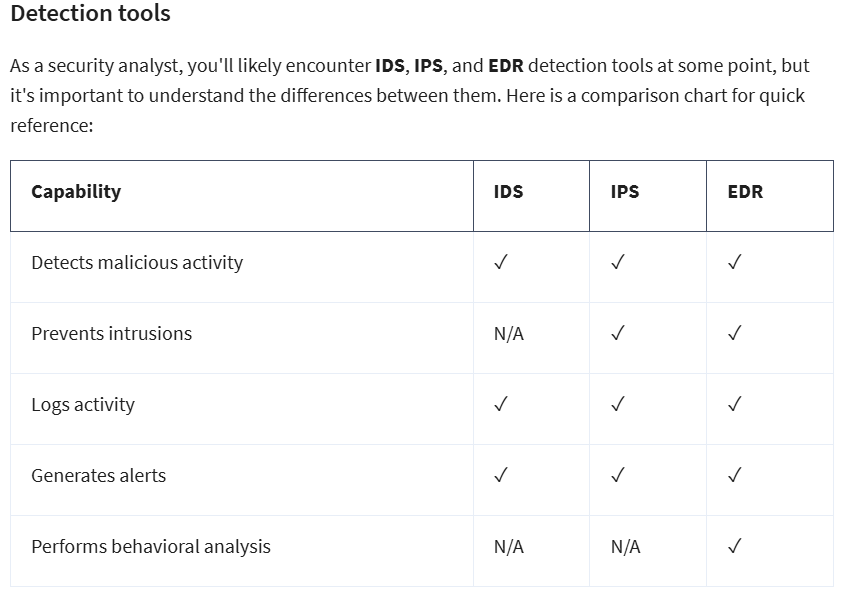
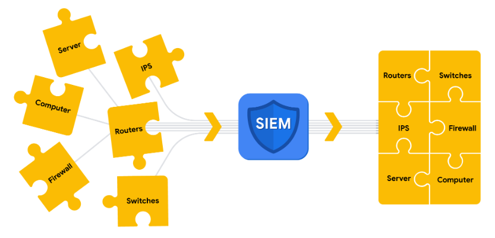
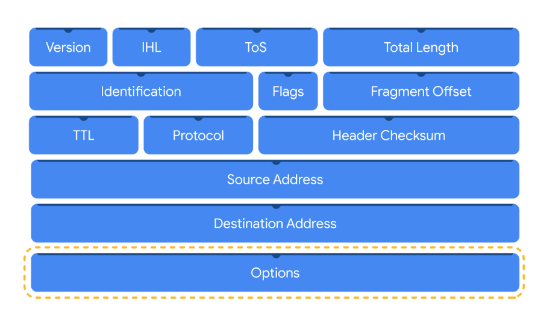
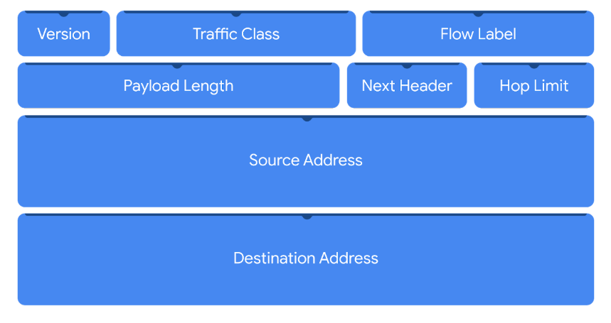
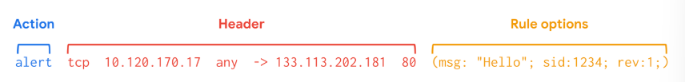

# Module 1 Incident Response

> ## Incident Lifecycle Response
>  **NIST CSF** : Identify, protect, detecet, respond, recover 
> ### Incident lifecycle based on NIST CSF
> 
>
> ### Incident (according to NIST)
> Incident is an occurrence that actually or imminently jeopardizes, without lawful authority, the confidentiality, integrity, or availability of information or an information system; or constitutes a violation or imminent threat of violation of law, security policies, security procedures, or acceptable use policies.
>
> ### Event
> An observable occurance on a network, system or device
>
> ## National Institute of Standards and Technology (NIST) Incident Response Lifecycle
> Is a framework for incident response consisting of four phases:
> 1. Preparation
> 2. Detection and Analysis
> 3. Containment, Eradication, and Recovery
> 4. Post-incident activity
>
> ### 5 W's of an incident
> - Who triggered the incident?
> - What happened?
> - When the incident took place?
> - Why the incident took place?
> - Why the incident occured?
> 
> ## Incident Handler's Journal
> A form of documentation used in incident response.
>
> ## Computer Security Incident Response Teams (CSIRT)
> A specialized group of security professionals that are trained in incident management and response. For incident response to be effective and efficient, there must be clear command, control, and communication of the situation to achieve the desired goal. 
>**Command** refers to having the appropriate leadership and direction to oversee the response.
>- **Control** refers to the ability to manage technical aspects during incident response, like coordinating resources and assigning tasks.
> - **Communication** refers to the ability to keep stakeholders informed.
>
> ### Roles in CSIRT
> CSIRTs are organization dependent, so they can vary in their structure and operation. Structurally, they can exist as a separate, dedicated team or as a task force that meets when necessary. CSIRTs involve both nonsecurity and security professionals. Nonsecurity professionals are often consulted to offer their expertise on the incident. These professionals can be from external departments, such as human resources, public relations, management, IT, legal, and others. Security professionals involved in a CSIRT typically include three key security related roles:  
>
> 1. **Security Analyst**:
> The job of the security analyst is to continuously monitor an environment for any security threats. This includes:  
> - Analyzing and triaging alerts
> - Performing root-cause investigations
> - Escalating or resolving alerts    
> If a critical threat is identified, then analysts escalate it to the appropriate team lead, such as the technical lead.
>
> 2. **Technincal lead**:
> The job of the technical lead is to manage all of the technical aspects of the incident response process, such as applying software patches or updates. They do this by first determining the root cause of the incident. Then, they create and implement the strategies for containing, eradicating, and recovering from the incident. Technical leads often collaborate with other teams to ensure their incident response priorities align with business priorities, such as reducing disruptions for customers or returning to normal operations. 
>
> 3. **Incident Coordinator**:
> Responding to an incident also requires cross-collaboration with nonsecurity professionals. CSIRTs will often consult with and leverage the expertise of members from external departments. The job of the incident coordinator is to coordinate with the relevant departments during a security incident. By doing so, the lines of communication are open and clear, and all personnel are made aware of the incident status. Incident coordinators can also be found in other teams, like the SOC. 
>
> **Other roles**
> Depending on the organization, many other roles can be found in a CSIRT, including a dedicated communications lead, a legal lead, a planning lead, and more.
>
> ## Security operations center
> A security operations center (SOC) is an organizational unit dedicated to monitoring networks, systems, and devices for security threats or attacks. Structurally, a SOC often exists as its own separate unit or within a CSIRT. You may be familiar with the term blue team, which refers to the security professionals who are responsible for defending against all security threats and attacks at an organization. A SOC is involved in various types of blue team activities, such as network monitoring, analysis, and response to incidents.
>
> A SOC is composed of SOC analysts, SOC leads, and SOC managers. Each role has its own respective responsibilities. SOC analysts are grouped into three different tiers. 
> 
>
> **Tier 1 SOC analyst**  
>>The first tier is composed of the least experienced SOC analysts who are known as level 1s (L1s). They are responsible for:
>>
>> - Monitoring, reviewing, and prioritizing alerts based on criticality or severity
>>
>> - Creating and closing alerts using ticketing systems
>>
>> - Escalating alert tickets to Tier 2 or Tier 3
>
> **Tier 2 SOC analyst**  
>> - The second tier comprises the more experienced SOC analysts, or level 2s (L2s). They are responsible for: 
>>
>> - Receiving escalated tickets from L1 and conducting deeper investigations
>> - Configuring and refining security tools
>> - Reporting to the SOC Lead  
>
> **Tier 3 SOC lead**  
> The third tier of a SOC is composed of the SOC leads, or level 3s (L3s). These highly experienced professionals are responsible for:
>> - Managing the operations of their team
>> - Exploring methods of detection by performing advanced detection techniques, such as malware and forensics analysis
>> - Reporting to the SOC manager
>
> **SOC manager**  
>The SOC manager is at the top of the pyramid and is responsible for: 
>> - Hiring, training, and evaluating the SOC team members
>> - Creating performance metrics and managing the performance of the SOC team
>> - Developing reports related to incidents, compliance, and auditing
>> - Communicating findings to stakeholders such as executive management   
>
> **_Other roles_**  
> SOCs can also contain other specialized roles such as:  
>
> **Forensic investigators**: Forensic investigators are commonly L2s and L3s who collect, preserve, and analyze digital evidence related to security incidents to determine what happened.  
>
> **Threat hunters**: Threat hunters are typically L3s who work to detect, analyze, and defend against new and advanced cybersecurity threats using threat intelligence.  

> _<u>Note:</u> Just like CSIRTs, the organizational structure of a SOC can differ depending on the organization._
>
> ## Elements of a Security plan
> - Policies
> - Standards
> - Procedures
>
> ### Incident response plan
> A document that outlines the procedures to take in each step of incident response
>
> ## Elements of an incident plan
> - Incident response procedures
> - System information
> - Other documents
>
> ## Tool Types
> - Detection and management tools
> - Documentation tools
> - Investigative tools

> ## Documentation
> Any form of recorded content that is used for a specific purpose
>
> ### Types of documenations
> - Playbooks
> - Incident handler's journals
> - Policies
> - Plans
> - Final reports
>
> ### Playbook 
> A manual that provides details about any operational action  
>
> _Word processor tools: Google Docs, OneNote, Evernote, Notepad++_  
> _Ticketing Systems: Jira_  
> _Other tools: Google sheets, Audio rcorders, Cameras, Handwritten Notes_
>
> ## Intrusion Detection System (IDS)
> An application taht monitors system and network activity and produces alerts on possible intrusions.  The goal of an IDS is to detect potential malicious activity and generate an alert once such activity is detected. An IDS does not stop or prevent the activity. Instead, security professionals will investigate the alert and act to stop it, if necessary.   
> Examples of IDS tools include Zeek, Suricata, Snort®, and Sagan.  
>
> ### Detection categories
> As a security analyst, you will investigate alerts that an IDS generates. There are four types of detection categories you should be familiar with:
>
>> **1. A true positive** is an alert that correctly detects the presence of an attack.  
>>
>> **2. A true negative** is a state where there is no detection of malicious activity. This is when no malicious activity exists and no alert is triggered.  
>>
>> **3. A false positive** is an alert that incorrectly detects the presence of a threat. This is when an IDS identifies an activity as malicious, but it isn't. False positives are an inconvenience for security teams because they spend time and resources investigating an illegitimate alert.  
>>
>> **4. A false negative** is a state where the presence of a threat is not detected. This is when malicious activity happens but an IDS fails to detect it. False negatives are dangerous because security teams are left unaware of legitimate attacks that they can be vulnerable to.  
>
> ## Intrusion Prevention System (IPS)
> An application that monitors system activity for intrusions and take action to stop the acitivity. An IPS works similarly to an IDS. But, IPS monitors system activity to detect and alert on intrusions, and it also takes action to prevent the activity and minimize its effects.  
> Tools like Suricata, Snort, and Sagan have both IDS and IPS capabilities.  
>
> ### Popular IDS and IPS tools
> - Snort
> - Zeek
> - Kismet
> - Sagan
> - Suricata
>
> ## EDR tools  
> Endpoint detection and response (EDR) is an application that monitors an endpoint for malicious activity. EDR tools are installed on endpoints. Remember that an endpoint is any device connected on a network.  
> EDR tools monitor, record, and analyze endpoint system activity to identify, alert, and respond to suspicious activity. Unlike IDS or IPS tools, EDRs collect endpoint activity data and perform behavioral analysis to identify threat patterns happening on an endpoint.  
> Tools like Open EDR®, Bitdefender™ Endpoint Detection and Response, and FortiEDR™ are examples of EDR tools.
>
> 
>
> ## Security Informatino and Event Management (SIEM)
> An application that collects and analyzes log data to monitor critical activities in an organisation
>
> ### SIEM advantages
> - Access to event data 
> - Monitoring, detecting and alerting
> - Log storage
> ### SIEM Process
>
> **1. Collect and aggregate data** : collect and centralize  
>   
> **2. Normalize data**: transform into a single format to process by SIEM  
>   
> **3. Analyze data**: Analyzes using some detection logic  
>
> Some commonly used SIEM tools: AlienVault® OSSIM™, Chronicle, Elastic, Exabeam, IBM QRadar® Security Intelligence Platform, LogRhythm, Splunk  
> ## Security Orchestration, Automation and Response (SOAR)
> A collection of applications, tools, and workflows that uses automationn to respond to security events.
>
>
# Module 2 Network Analysis
>
> ### Network Traffic
> The amount of data that moves along the network.
> ### Network data
> The data that's transmimtted between devices on a network.
>
> ## Indicators of Compromise (IOC)
> Observable evidence that suggests sings of a potential security incident.
>
> ## Data Exfiltration
> Unauthorizaed access of data from a system
>
> ## Maintain awareness with Network Monitoring
> ### Baseline
A baseline is a reference point that’s used for comparison. . Essentially, by knowing the baseline of normal network behavior, you'll be better able to identify abnormal network behavior.
>
> ### Monitor your network
> Once you’ve determined a baseline, you can monitor a network to identify any deviations from that baseline. Monitoring involves examining network components to detect unusual activities, such as large and unusual data transfers. Here are examples of network components that can be monitored to detect malicious activity:
> - **Flow analysis**  
> - **Packet payload information**  
> -  **Temporal patterns**  
>
> ## Data exfiltration attacks
> Attackers attack a system and try to maintain access by stealing data from the system while also using a tactic called ***lateral movement*** or ***pivoting*** trying to attack other systems or network devices to maintain access for as long as possible
> #### Defensive measures:
> - Using Multi-factor Authentication.
> - Montior suspicious activity
> - Protect Assets
> - Detect and stop the exfiltration
>
> ## Network Protocol Analyzer (Packet SNiffer)
> A network protocol analyzer, or packet sniffer, is a tool designed to capture and analyze data traffic within a network. Examples of network protocol analyzers include tcpdump, Wireshark, and TShark. 
> 
> ## Packet Capture (P-cap)
> A file containing data packets intercepted from an interface or network

> ### IPv4
> IPv4 is the most commonly used version of IP. There are thirteen fields in the header:
>
> Version: This field indicates the IP version. For an IPv4 header, IPv4 is used. 
>
> Internet Header Length (IHL): This field specifies the length of the IPv4 header including any Options.
>
> Type of Service (ToS): This field provides information about packet priority for delivery.
>
> Total Length: This field specifies the total length of the entire IP packet including the header and the data.
>
> Identification: Packets that are too large to send are fragmented into smaller pieces. This field specifies a unique identifier for fragments of an original IP packet so that they can be reassembled once they reach their destination.
>
> Flags: This field provides information about packet fragmentation including whether the original packet has been fragmented and if there are more fragments in transit.
>
> Fragment Offset: This field is used to identify the correct sequence of fragments.
>
> Time to Live (TTL): This field limits how long a packet can be circulated in a network, preventing packets from being forwarded by routers indefinitely.
>
> Protocol: This field specifies the protocol used for the data portion of the packet.
>
> Header Checksum: This field specifies a checksum value which is used for error-checking the header.
>
> Source Address: This field specifies the source address of the sender.
>
> Destination Address: This field specifies the destination address of the receiver.
>
> Options: This field is optional and can be used to apply security options to a packet.
>
>  
>
>
> ## IPv6
>
>IPv6 adoption has been increasing because of its large address space. There are eight fields in the header:
>
> Version: This field indicates the IP version. For an IPv6 header, IPv6 is used.
>
> Traffic Class: This field is similar to the IPv4 Type of Service field. The Traffic Class field provides information about the packet's priority or class to help with packet delivery.
>
> Flow Label: This field identifies the packets of a flow. A flow is the sequence of packets sent from a specific source. 
> 
> Payload Length: This field specifies the length of the data portion of the packet.
>
> Next Header: This field indicates the type of header that follows the IPv6 header such as TCP.
>
> Hop Limit: This field is similar to the IPv4 Time to Live field. The Hop Limit limits how long a packet can travel in a network before being discarded.
>
> Source Address: This field specifies the source address of the sender.
>
> Destination Address: This field specifies the destination address of the receiver.
>
> 
>
>
# Module 3 
> ## Detection
> The prompt discovery of security events
>
> ## Analysis
>  Investigation and validation of alerts
>  
> ## CHallenges in the detection and analysis phase
> - Impossible to detect everything
> - High Volume of Alerts
> 
> ## Methods of Detection
> ### Threat hunting
> Threat hunting is the proactive search for threats on a network. Security professionals use threat hunting to uncover malicious activity that was not identified by detection tools and as a way to do further analysis on detections. Threat hunting is also used to detect threats before they cause damage. For example, fileless malware is difficult for detection tools to identify.
> **Note:** Threat hunting specialists are known as threat hunters. Threat hunters perform research on emerging threats and attacks and then determine the probability of an organization being vulnerable to a particular attack. Threat hunters use a combination of threat intelligence, indicators of compromise, indicators of attack, and machine learning to search for threats in an organization.
>
> ### Threat intelligence
>  It is evidence-based threat information that provides context about existing or emerging threats. 
>
> Threat intelligence can come from private or public sources like:
>
> - Industry reports: These often include details about attacker's tactics, techniques, and procedures (TTP).
> 
> - Government advisories: Similar to industry reports, government advisories include details about attackers' TTP. 
> 
> - Threat data feeds: Threat data feeds provide a stream of threat-related data that can be used to help protect against sophisticated attackers like advanced persistent threats (APTs). APTs are instances when a threat actor maintains unauthorized access to a system for an extended period of time. The data is usually a list of indicators like IP addresses, domains, and file hashes.
>
>  ## Cyber deception
> Cyber deception involves techniques that deliberately deceive malicious actors with the goal of increasing detection and improving defensive strategies.  
> **Example:** Honeypots   They are systems or resources that are created as decoys vulnerable to attacks with the purpose of attracting potential intruders. For example, having a fake file labeled Client Credit Card Information - 2022 can be used to capture the activity of malicious actors by tricking them into accessing the file because it appears to be legitimate. Once a malicious actor tries to access this file, security teams are alerted.
>
> ## Indicators of compromise
> Indicators of compromise (IoCs) are observable evidence that suggests signs of a potential security incident. IoCs chart specific pieces of evidence that are associated with an attack, like a file name associated with a type of malware. You can think of an IoC as evidence that points to something that's already happened, like noticing that a valuable has been stolen from inside of a car. 
>
> ***Indicators of attack (IoA)*** are the series of observed events that indicate a real-time incident.  IoAs focus on identifying the behavioral evidence of an attacker, including their methods and intentions.  
>
> Essentially, IoCs help to identify the who and what of an attack after it's taken place, while IoAs focus on finding the why and how of an ongoing or unknown attack. For example, observing a process that makes a network connection is an example of an IoA. The filename of the process and the IP address that the process contacted are examples of the related IoCs.
>
> ## Pyramid of Pain
> 
> 
>
> 1. Hash values: Hashes that correspond to known malicious files. These are often used to provide unique references to specific samples of malware or to files involved in an intrusion.
>
> 2. IP addresses: An internet protocol address like 192.168.1.1
> 
> 3. Domain names: A web address such as www.google.com 
> 
> 4. Network artifacts: Observable evidence created by malicious actors on a network. For example, information found in network protocols such as User-Agent strings. 
> 
> 5. Host artifacts: Observable evidence created by malicious actors on a host. A host is any device that’s connected on a network. For example, the name of a file created by malware.
>
> 6. Tools: Software that’s used by a malicious actor to achieve their goal. For example, attackers can use password cracking tools like John the Ripper to perform password attacks to gain access into an account.
>
> 7. Tactics, techniques, and procedures (TTPs): This is the behavior of a malicious actor. Tactics refer to the high-level overview of the behavior. Techniques provide detailed descriptions of the behavior relating to the tactic. Procedures are highly detailed descriptions of the technique. TTPs are the hardest to detect. 
>
>
> ### Benefits of documentation
> - Transparency
> - Standardization
> - Clarity
> 
> ## Chain of custody
> The process of documenting evidence, possession and control during an evidence lifecycle
>
> ### Broken chain of custody
> Inconsistencies in the collection and logging of evidence in the chain of custody
>
> ### Chain of custody establishes
> - Integrity
> - Reliability
> - Accuracy
>
> ## Types of playbooks
> - Non-Automated
> - Automated
> - Semi-automated
>
> ## Triage
> The prioritizing of incidents accourding to thier level of importance or urgency
>
> ### Triage Process
> 1. Receive and Assess an alert
> 2. Assign priority
> 3. Collect and analyze
> 
> ## Containment
> The act of limiting and preventing additional damaged caused by an incident.
> 
> ## Eradication
> The complete removal of the incident elemts from all affected systems
>
> ## Recovery
> The process of returning affected systems back to normal operations
>
> ## Post-incident activity phase
> The process of reviewing an incident to identify areas for improvement during incidient handling
>
> ## Final report
> Documentation that provides a comprehensive view of an incident. THis report will be used during "LEssons Learned" meeting, also known as Post-moterm meeting.
>
> ### QUestions to ask during the meeting
> - What happened?
>
> - What time did it happen?
>
> - Who discovered it?
> 
> - How did it get contained?
> 
> - What were the actions taken for recovery?
>
> - What could have been done differently?
>
# Module 4: Logs
>
> ## Log
> A record of events that occur within an organization's systems  
> Logs contains details such as name, date, time, location, action.  
> Example: `Login Event [05:45:15] User1 Authenticated successfully`
> 
> ### Log analysis
> The process of examining logs to identfy events of interest
>
> ### Log types
> - Network:     Network logs are generated by network devices like firewalls, routers, or switches.
> - System:      System logs are generated by operating systems like Chrome OS™, Windows, Linux, or macOS®. 
> - Application:   Application logs are generated by software applications and contain information relating to the events occurring within the application such as a smartphone app.
> - Security:    Security logs are generated by various devices or systems such as antivirus software and intrusion detection systems. Security logs contain security-related information such as file deletion.
> - Authenication:   Security logs are generated by various devices or systems such as antivirus software and intrusion detection systems. Security logs contain security-related information such as file deletion.
>
>
> ## Log management
>  Log management is the process of collecting, storing, analyzing, and disposing of log data. 
> - What to log
> - Issue with overlogging
> - Log retention
> - Log protection
>
> ## Commonly used log formats
> - #### Syslog
    >> A detailed logging format
> - #### JavaScript Object Notation (JSON)
    >> Has a specific structure similar to JavaScript to store logs.
> - #### eXtensible Markup Language (XML)
    >> Uses tags to store logs
> - #### Comma Seperated Values (CSV)
    >> Uses commas to seperate data
>
> ## Telemetry
> The collection and transmission of data for analysis
>
> ## Intrusion Detection System (IDS)
> An application that monitors activity and alerts on possible intrusions
>
> ### Host-based IDS
> An application that monitors the activity of the host on which it's installed. Hosts are also endpoints, which are any device connected to a netowkr like a computer or server
>
> ### Network IDS
> An application that collects and monitos network traffic and network data. NIDS software is installed on devices located at specific parts of the network that you want to monitor. The NIDS application inspects network traffic from different devices on the network. If any malicious network traffic is detected, the NIDS logs it and generates an alert.
>
> ## Detection Techniques
> - ### Signature analysis
> A detection method used to find events of interest. A signature is a pattern that is associated with malicious activity. Signatures can contain specific patterns like a sequence of binary numbers, bytes, or even specific data like an IP address. 
> **Advantages:**  
> - Low rate of false positives
> **Disadvantages:**  
> - Signatures can be evaded
> - Signatures require updates
> - Inability to detect unknown threats
>
> - ### Anomaly-based analysis
> Anomaly-based analysis is a detection method that identifies abnormal behavior. There are two phases to anomaly-based analysis: a training phase and a detection phase. In the training phase, a baseline of normal or expected behavior must be established. Baselines are developed by collecting data that corresponds to normal system behavior. In the detection phase, the current system activity is compared against this baseline. Activity that happens outside of the baseline gets logged, and an alert is generated. 
>
> **Advantages:**  
> - Ability to detect new and evolving threats
> **Disadvantages:**  
> - High rate of false positives
> - Pre-existing compromise
>
> ## Components of a NIDS
> 1. Action  
> Determines the action to take if the rule criteria is met.
> 2. Header  
> Defines the signature's network traffic, i.e. it includes information such as source and destination IP, source and destination ports, protocols and traffic direction.
> 3. Rule option  
> Helps us customize signatures with additional parameters.
> Configuring rule options helps in narrowing down network traffic, so you can find exactly what you're looking for. Typically, rule options are separated by semi-colons and enclosed in parentheses.
>
> ## Suricata
> Suricata is an open-source intrusion detection system, intrusion prevention system, and network analysis tool.
>
> ### Suricata features
> There are three main ways Suricata can be used:
>
> - **Intrusion detection system (IDS)**: As a network-based IDS, Suricata can monitor network traffic and alert on suspicious activities and intrusions. Suricata can also be set up as a host-based IDS to monitor the system and network activities of a single host like a computer.
>
> - **Intrusion prevention system (IPS)**: Suricata can also function as an intrusion prevention system (IPS) to detect and block malicious activity and traffic. Running Suricata in IPS mode requires additional configuration such as enabling IPS mode. 
>
> - **Network security monitoring (NSM)**: In this mode, Suricata helps keep networks safe by producing and saving relevant network logs. Suricata can analyze live network traffic, existing packet capture files, and create and save full or conditional packet captures. This can be useful for forensics, incident response, and for testing signatures. For example, you can trigger an alert and capture the live network traffic to generate traffic logs, which you can then analyze to refine detection signatures.
>
> ### Rules or Signatures
> Rules or signatures are used to identify specific patterns, behavior, and conditions of network traffic that might indicate malicious activity.  
> Suricata uses signatures analysis, which is a detection method used to find events of interest. Signatures consist of three components:
>
> - **Action**: The first component of a signature. It describes the action to take if network or system activity matches the signature. Examples include: alert, pass, drop, or reject.
>
> - **Header**: The header includes network traffic information like source and destination IP addresses, source and destination ports, protocol, and traffic direction.
>
> - **Rule options**: The rule options provide you with different options to customize signatures.
>
> 
>
>  ## Configuration File
>  A configuration file is a file used to configure the settings of an application. Configuration files let you customize exactly how you want your IDS to interact with the rest of your environment.  
> Suricata's configuration file is `suricata.yaml`, which uses the YAML file format for syntax and structure.
>
> #### Suricata Log format type
> - **`eve.json`**(Extensible Event Format JavaScript Object Notation)  
> The `eve.json` file is the standard Suricata log file. This file contains detailed information and metadata about the events and alerts generated by Suricata stored in JSON format. 
> - **`fast.log`**  
> The `fast.log` file is used to record minimal alert information including basic IP address and port details about the network traffic. The fast.log file is used for basic logging and alerting and is considered a legacy file format and is not suitable for incident response or threat hunting tasks.
> #### Suricata log  Types
> - Alert Logs
> - Network Telemetry logs
>
> ## Security Information and Event Management (SIEM)
> An application that collects and analyzes log data to monitor critical activities in an organisation
>
> ### SIEM Process Overview
> 1. **Collect and aggregate data**: SIEM tools collect event data from various data sources.
>
> 2. **Normalize data**: Event data that's been collected becomes normalized. Normalization converts data into a standard format so that data is structured in a consistent way and becomes easier to read and search. While data normalization is a common feature in many SIEM tools, it's important to note that SIEM tools vary in their data normalization capabilities.
>
> 3. **Analyze data**: After the data is collected and normalized, SIEM tools analyze and correlate the data to identify common patterns that indicate unusual activity. 
>
> #### Log Ingestion
> Log ingestion is the process of collecting and importing data from log sources into a SIEM tool. Data comes from any source that generates log data, like a server.
>
> #### Log forwarders
> A common way that organizations collect log data is to use log forwarders. Log forwarders are software that automate the process of collecting and sending log data. Some operating systems have native log forwarders. If you are using an operating system that does not have a native log forwarder, you would need to install a third-party log forwarding software on a device. After installing, the software is configued on how to get logs. 
>
> ## Splunk
> ### Search Processing Language (SPL)
> Splunk's query language  
> Example 1: `index=main fail`  
>  - `index=main:` This is the beginning of the search command that tells Splunk to retrieve events from an index named *main*. An index stores event data that's been collected and processed by Splunk.
>
> - `fail:` This is the search term. This tells Splunk to return any event that contains the term *fail*.
> 
> Example 2: (using piping) 
> `index=main fail` **|** `chart count by host`  
> - `index=main fail`:  This is the beginning of the search command that tells Splunk to retrieve events from an index named *main* for events containing the search term *fail*. 
> - **`|`**: The pipe character separates and chains the two commands `index=main` and `chart count by host`. This means that the output of the first command `index=main` is used as the input of the second command `chart count by host`. 
> - `chart count by host`: This command tells Splunk to transform the search results by creating a `chart` according to the  count or number of events. The argument `by host` tells Splunk to list the events `by host`, which are the names of the devices the events come from. This command can be helpful in identifying hosts with excessive failure counts in an environment.
>
>> **Note:** A wildcard is a special character that can be substituted with any other character. A wildcard is usually symbolized by an asterisk character `*`. Wildcards match characters in string values. In Splunk, the wildcard that you use depends on the command that you are using the wildcard with. Wildcards are useful because they can help find events that contain data that is similar but not entirely identical. 
>>> Example: `index=main fail*`
>>> - `index=main`: This command retrieves events from an index named *main*. 
>>>
>>> - `fail*`: The wildcard after fail represents any character. This tells Splunk to search for all possible endings that contain the term *fail*. This expands the search results to return any event that contains the term *fail* such as *“failed”* or *“failure”*.
>> **Pro tip**: Double quotations are used to specify a search for an exact phrase or string. For example, `"login failure"` will match only events that contain the exact phrase *`login failure`* and not other events that contain the words *failure* or *login* separately.
>
> ## Gooogle Security Operations (Chronicle) searches
> In Google SecOps (Chronicle), you can search for events using the Search field. You can also use Procedural Filtering to apply filters to a search to further refine the search results.
>
> ### Types of search
> 1. **UDM Search** (Unified Data Model)  
> A UDM Search retrieves events formatted in UDM and these events contain UDM fields. There are many different types of UDM fields that can be used to query for specific information from an event.  A UDM Search retrieves search results faster than a Raw Log Search because it searches through indexed and structured data that’s normalized in UDM.
> - **Entities**: Entities are also known as nouns. All UDM events must contain at least one entity. This field provides additional context about a device, user, or process that’s involved in an event.
>
> - **Event metadata**: This field provides a basic description of an event, including what type of event it is, timestamps, and more. 
>
> - **Network metadata**: This field provides information about network-related events and protocol details. 
>
> - **Security results**: This field provides the security-related outcome of events.
>
>> Example: `metadata.event_type = “USER_LOGIN”`
>> `metadata.event_type = “USER_LOGIN”`: This UDM field `metadata.event_type` contains information about the event type. This includes information like timestamp, network connection, user authentication, and more. Here, the event type specifies `USER_LOGIN`, which searches for events relating to authentication. 
> 
> 2. **Raw log search**
> If you can't find the information you are searching for through the normalized data, using a Raw Log Search will search through the raw, unparsed logs. Because it is searching through raw logs, it takes longer than a structured search. In the Search field, you can perform a Raw Log Search by specifying information like usernames, filenames, hashes, and more. 
>> **Pro tip**: Raw Log Search supports the use of regular expressions, which can help you narrow down a search to match on specific patterns.
> ### YARA-L
> A computer language used to create rules for searching through ingested log data
>