# Automate Cyberscurity Tasks with Python
# Module 1
> ## Programming
> Used to create a specific set of insturctions for a computer to execute tasks
>
> ## Automation
> The use of technology to reduce human and manual effeor to perform common and repetitive tasks
>
> ### Advantages of Python
> - Resembles human language
> - Requires Less code
> - Easy to read
> - Standard guidelines
> - Online support
> - Built-in code
>
> ## Python
> Python is a general purpose programming language that can be used to solve a variety of problems. For example, it can be used to build websites, perform data analysis, and automate tasks. 
>
>Python code must be converted through an interpreter before the computer can process it. An interpreter is a computer program that translates Python code into runnable instructions line by line. 
>
> ### Python in Cybersecurity
> Python is used in cybersecurity especially for automation. \
Some areas of cybersecurity in which Python might be used to automate specific tasks: \
> - Log analysis
> - Malware analysis
> - Access control list management
> - Intrusion detection
> - Compliance checks
> - Network scanning
>
> ## Comment
> A note programmers make about the intention behind their code \
> Syntax: starts with `#` \
> Example: `# Print hello python`
>
> ### print()
> Outputs a specified object tot he screen \
> Syntax:  `print(<value>)` \
> Example: `print("Hello")` \
> **Note**: Strings need to be placed in quotation marks (`"`) 
>
> #### Basic program example
> ```
> # Print Hello Python program
> print("Hello Python!")
>```
>
> ## Python environments
> You can run Python through a variety of environments. These environments include notebooks, integrated development environments (IDEs), and the command line. 
>
> ### Notebooks
> A notebook is an online interface for writing, storing, and running code. They also allow you to document information about the code. Notebook content either appears in a code cell or markdown cell.
> 
> #### Code cells
> Code cells are meant for writing and running code. A notebook provides a mechanism for running these code cells. Often, this is a play button located within the cell. When you run the code, its output appears after the code. 
>
> #### Markdown cells
> Markdown cells are meant for describing the code. They allow you to format text in the markdown language. 
>
> ### Integrated development environments (IDEs)
> Another option for writing Python code is through an integrated development environment (IDE), or a software application for writing code that provides editing assistance and error correction tools. Integrated development environments include a graphical user interface (GUI) that provides programmers with a variety of options to customize and build their programs. 
>
> ### Command line
> Command-line interface (CLI) is a text-based user interface that uses commands to interact with the computer. By entering commands into the command line, you can access all files and directories saved on your hard drive, including files containing Python code you want to run. You can also use the command line to open a file editor and create a new Python file.
>
> ## Data Types in Python
> Category for a particular type of data item
> - #### String data
> Data consisting of an ordered sequence of characters \
> Syntax : `"<string_here>"`
> *Examples*: `"hello", "this is it", ""`.
>> ***Note***: `""` is called an empty string
>
> - #### Float data
> Data consisting of a number with a decimal point. \
> *Example*: 5.6,10.2,-200.3,-0.34,0.0
>
> - #### Integer data
> Data consisting of a number that does not include a decimal point \
> *Example*: -6,12,-200,0,32100,480398423
>
> - #### Boolean data
> Data that can only be one of two values: either True or False
>
> - #### List data
> Data structure that consists of a collection of data in sequential form \
> Syntax: `[value1,value2,...]`
> *Example*:
>```
>[12, 36, 54, 1, 7]
>["eraab", "arusso", "drosas"]
>[True, False, True, True]
>[15, "approved", True, 45.5, False]
>[]
>```
>> ***Note***: `[]` is called an empty list
>
> - #### Tuple
> Tuple data is a data structure that consists of a collection of data that cannot be changed. Like lists, tuples can contain elements of varying data types. \
> Syntax: `(<value1>,<value2>,...)` \
> *Examples*:
> ```
> ("wjaffrey", "arutley", "dkot")
> (46, 2, 13, 2, 8, 0, 0)
> (True, False, True, True)
> ("wjaffrey", 13, True)
>```
>
> - #### Dictionary
> Dictionary data is data that consists of one or more key-value pairs. Each key is mapped to a value. A colon (:) is placed between the key and value. Commas separate key-value pairs from other key-value pairs. \
> Syntax: `{key1: value 1, key2: value2, ...}` \
> Dictionaries are useful when you want to store and retrieve data in a predictable way. For example, the following dictionary maps a building name to a number. The building name is the value, and the number is the key. A colon is placed after the key. \
> *Example*:
> `{ 1: "East", 2: "West",  3: "North",  4: "South" }`
>
> - #### Set data
> In Python, set data is data that consists of an unordered collection of unique values. This means no two values in a set can be the same. \
> Elements in a set are always placed within curly brackets and are separated by a comma. These elements can be of any data type. \
> This example of a set contains strings of usernames: `{"jlanksy", "drosas", "nmason"}`
>
> ## Variables
> A container that stores data
>
> ### type()
> Returns the data type of its input \
> Syntax: `type(<variable>)`
> 
> ## Conditional Statements
> A conditional statement is a statement that evaluates code to determine whether it meets a specific set of conditions. When a condition is met, it evaluates to a Boolean value of True and performs specified actions. When the condition isn’t met, it evaluates a Boolean value of False and doesn’t perform the specified actions. 
> ### `if` Statements
> *Syntax*: \
> ```
> if  <condition>: # (Header) starts a conditional statement
>  <code_to_execute> # (Body) the code to execute if said condition is met
> ```
> *Example*: \
> ```
> if failed_attempts > 5:
>   print("Account Locked")
> ```
>
> ### Conditional Operators
> - `>` - Greater than
> - `<` - Less than
> - `>=` - Greater than equal to
> - `<=` - Less than equal to
> - `==` - (equal to) Evaluates whether two objects match
> - `!=` - (not equal to) Evaultes whether two objects are different
>
> ### `else` statement
> Precedes a code section that only evaluates when all conditions that precede it within the conditional statement evaluate to false
>
> *Syntax*: \
> ```
> if  <condition>: # (Header) starts a conditional statement
>  <code_to_execute> # (Body) the code to execute if said condition is met
> else:
> <code_to_execute_if_previous_condition_is_not_met>
> ```
> *Example*: \
> ```
> operating_system = "OS 3"
> if operating_system == "OS 2":
>   print("Update needed")
> else: 
>   print("No updates needed")
> ```
>
> ### `elif` statements
> A conditional statement is a statement that evaluates code to determine whether it meets a specific set of conditions. When a condition is met, it evaluates to a Boolean value of True and performs specified actions. When the condition isn’t met, it evaluates a Boolean value of False and doesn’t perform the specified actions. 
>
> *Syntax*: \
> ```
> if  <condition>: # (Header) starts a conditional statement
>  <code_to_execute> # (Body) the code to execute if said condition is met
> elif:
> <code_to_execute_if_previous_condition_is_not_met>
> elif: # we can add as many as needed
> <code_to_execute_if_previous_condition_is_not_met>
> else:
> <code_to_execute_if_previous_condition_is_not_met>
> ```
> *Example*: \
> ```
> if status == 200:
>    print("OK")
> elif status == 400:
>    print("Bad Request")
> elif status == 500:
>    print("Internal Server Error")
> else:
>    print("check other status")
> ```
>
> ### Logical operators for multiple conditions
> In some cases, you might want Python to perform an action based on a more complex condition, where two or more conditions need to be met to evaluate *True* or *False*. In such cases, the logical operatos can be used to connect the conditions. \
> The logical operators are 
> - `and`
> - `or`
> - `not`
>
> ### Logical `and`
> The `and` operator requires both conditions on either side of the operator to evaluate to *True*. 
> *Example*: \
> In this case, let us say all HTTP status response codes between 200 and 226 relate to successful responses. For this, the code can be written as \
> ```
> if (status >= 200 and status <= 226):
>    print("successful response")
> ```
>
> ### Logical `or`
> The `or` operator requires only one of the conditions on either side of the operator to evaluate to *True*.  
> *Example*: \
> Both a status code of 100 and a status code of 102 are informational responses. We can use python to print an informational response when code is 100 or 102. \
> ```
> if (status == 100 or status == 102):
>    print("informational response")
> ```
>
> ### Logical `not`
> The `not` operator negates a given condition so that it evaluates to _False if the condition is True_ and to _True if the condition is False_.  
> *Example*: \
> We want to indicate that Python should check the status code when it’s something outside of the successful range, you can use not: \
> ```
> if not (status >= 200 or status <= 226):
>    print("check status")
> ```
>
> ## Iterative statement (Loops)
> Code that repeatedly executes a set of instructions
>
> ### `for` Loop
> Code is executed based on a sequence
> *Syntax*: 
> ```
> for <loop_variable> in <sequence>: # header
>   <code_to_execute> # this wil continue until sequence ends
> ```
>
> ### `range()`
> Used to give a range of numbers \
> *Example*: `range(0,10)` = 0,1,2,3,4,5,6,7,8,9 \
>> if no starting number is given, the range starts from 0. The end point is always required and we can add another number to change the count.
>
>> *For example:* `range(0,10,2)` = 0,2,4,6,8
>
> ### `while` Loop
> If you want a loop to iterate based on a condition, you should use a while loop. As long as the condition is True, the loop continues, but when it evaluates to False, the while loop exits 
>
> *Syntax*: 
> ```
> while <condition>: # header
>   <code_to_execute> # (body) this wil continue until condition is satisfied
> ```
>
> ### `break`
> When you want to exit a `for` or `while` loop based on a particular condition in an if statement being **True**, you can write a conditional statement in the body of the loop and write the keyword `break` in the body of the conditional. \
> *Example*:
> 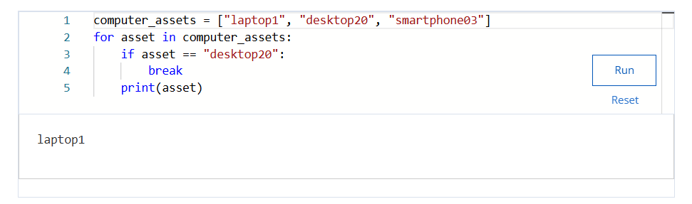
>
>### `continue`
> When you want to skip an iteration based on a certain condition in an if statement being True, you can add the keyword continue in the body of a conditional statement within the loop \
> *Example*:
> 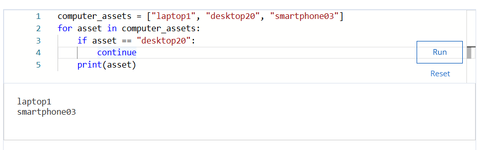
>
> ### Infinite loops
> If you create a loop that doesn't exit, this is called an infinite loop. In these cases, you should press CTRL-C or CTRL-Z on your keyboard to stop the infinite loop. You might need to do this when running a service that constantly processes data, such as a web server.
>
# Module 2
>
> ## Function
> A section of code that can be reused in a program
>
> ## Built-in functions
> Functions that exist within Python and can be called directly
>
> ## User-defined functions
> Functions that programmers design for their specific 
>
> ### `def`
>  Placed before a function name to define a function \
> *Example*: \
> ```
> def myfunction():
>   print("This is a user-defined function!")
> myfunction()
> ```
> Output: \
> This is a user-defined function!
>
> ## Parameter
> An object tht is included in a function definition for use in that function
>
> ## Argument (Python)
> Data brought into a function when it is called
>
> Example with one parameter: \
> 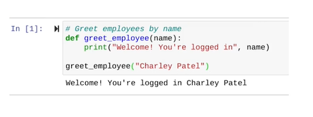 \
> Here *name* is parameter and *Chaarlie Patel* is Argument
>
> Example with two parameters: \
> 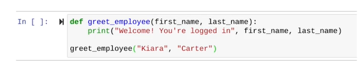 \
> Here *first_name , last_name* are parameters and *Kiara , Carter* are arguments
>
> ## Return Statement
> A python statement that executes inside a function and sends information back to the function call
>
> ### `return`
> Used to return information from a function
> 
> *Example*: \
> 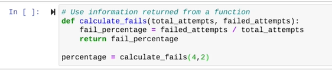
>
> ## Global variables
> A global variable is a variable that is available through the entire program. Global variables are assigned outside of a function definition. Whenever that variable is called, whether inside or outside a function, it will return the value it is assigned.
>
> ## Local variables
> A local variable is a variable assigned within a function. These variables cannot be called or accessed outside of the body of a function. Local variables include parameters as well as other variables assigned within a function definition.
>
> ## Built-in Functions
> Functions that exist within Python and can be called directly
>
> - `print()` \
> Outputs a specified object to the screen \
> *Example*: 
> ```
> month = "September"
> print("Investigate failed login attempts during", month, "if more than", 100) # Investigate failed login attempts during September if more than 100
> ```
>
> - `type()` \
> Returns data type of its input \
> > *Example*: 
> ```
> print(type("This is a string")) # <class 'str'>
> ```
>
> - `max()` \
> Returns the largest numeric input passed to it \
>
> - `min()` \
> Returns the smalltest numeric input passed into it. \
>
> *Example*: 
> ```
> time_list = [12, 2, 32, 19, 57, 22, 14]
>print(min(time_list)) # 2
>print(max(time_list)) # 57
>```
>
> - `sorted()` \
> Sorts the components of a list \
> *Example:* 
> ```
> time_list = [12, 2, 32, 19, 57, 22, 14]
> print(sorted(time_list))
> ```
> 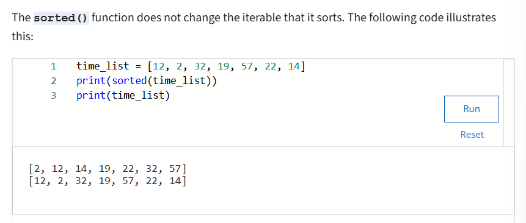
>
> ## Module
> A python file that contains additional functions, variables, classes and any kind of runnable code
>
> ## Python Standard Library
> An extensive collection of usable Python code that often comes packaged with Python
>
> ### Python Standard Library modules
> - The `re` module, which provides functions used for searching for patterns in log files
>
> - The `csv` module, which provides functions used when working with `.csv` files
>
> - The `glob` and `os` modules, which provide functions used when interacting with the command line
>
> - The `time` and `datetime` modules, which provide functions used when working with timestamps
> - The `statistics` module includes functions used when calculating statistics related to numeric data.
>
> ### Importing an entire module
> To import an entire Python Standard Library module, you use the import keyword. \
> *Example:* \
> 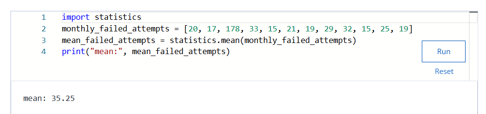
>
> ### Importing specific functions from a module
> To import a specific function from the Python Standard Library, you can use the from keyword. \
> *For example*, if you want to import just the `median()` function from the `statistics` module, you can write `from statistics import median`.
>
> 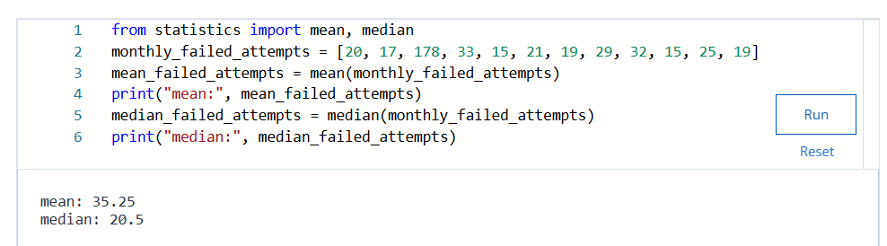
>
> ### External libraries
> In addition to the Python Standard Library, you can also download external libraries and incorporate them into your Python code. \
> To install a library, such as numpy, in either environment, you can run the following line prior to importing the library: \
>`%pip install numpy` \
> After a library is installed, you can import it directly into Python using the import keyword \
> `import numpy`
>
> ## Style Guide
> A manual that informs the writing, formatting and design of documents
>
> ### Comments
> A note programmers make about the intentions behind their code
> 
> ### Indentation
> Space addeded at the beginning of the line of code
>
> 
# Module 3
> 
> ## String data
> Data consisting of an ordered sequence of characters \
> *example:* "123" "Hello" "Number 1"
> 
> ### `str()`
> Converts the input object to a string \
> *Example:* \
> 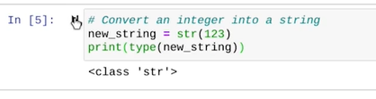
>
> ### `len()` 
> returns the number of elements in an object \
> *Example:* \
> 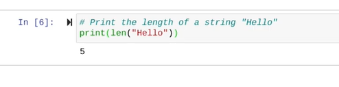 
>
> ## String Concatenation
> The process of joining two strings together \
> *Example:* \
> 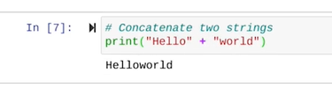
>
> ### Method
> A function that belongs to a specific data type
>
> ## String Methods
> String methods are placed after the string.
>
> ### `.()upper`
> Returns a copy of the string in all uppercase letters \
> *Example*: \
> 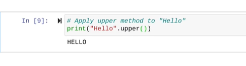
>
> ### `.()lower`
> Returns a copy of the string in all lowercase letters \
> *Example*: \
> 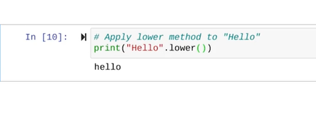
>
> ## Index
> A number assgined to every element in a sequence that indicates its position \
> Indices start at 0. \
> 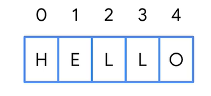
>
> ## Slicing
> A slice is a part of the string \
> 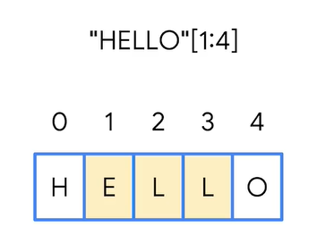 \
> 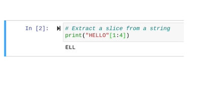
>
> ### `.index()`
> Finds the first occurrence of the input in a string and returns its location. \
> 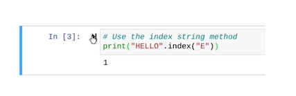 \
> 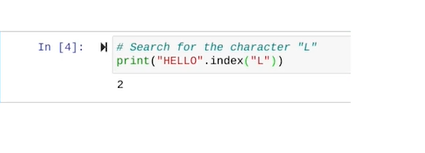
>
> ### Immutable
> Cannot be changed after it is created and assigned a value. \
> Strings are immutable. 
>
> ## Lists
> List data is a data structure that consists of a collection of data in sequential form. 
> 
> ## List slicing
>  Similar to strings, you can use bracket notation to extract elements or slices in a list. \
> *Example*: \
> 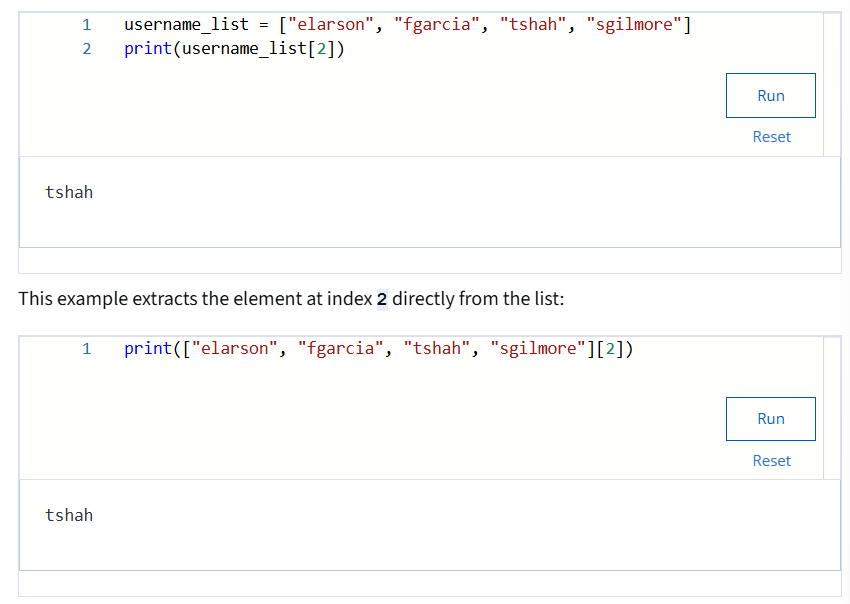
>
> ## List concatenation
> Combining two lists into one by placint the elements of the second list directly after the elements of the first list \
> *Example:* \
> 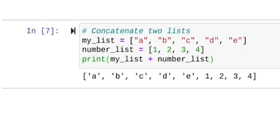 
>
>> **Note**: Lists are not immutable \
>> 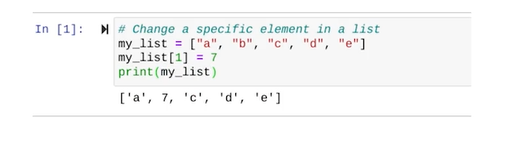
>  
> ## List methods
> 
> ### `.insert()`
> Adds an element in specific position inside a list \
> It takes two arguments, position and value \
> Syntax: `<variable>.insert(<position>,<value>)`
> *Example*: \
> 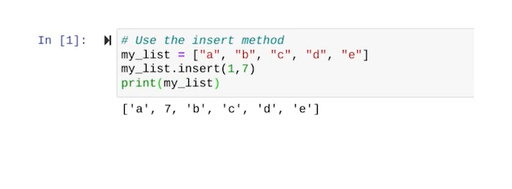
>
> ### `.remove()`
> Removes the first occurence of a specific element in a list \
> Syntax: `<varable>.remove(<value to remove>)` \
> *Example:* : \
> 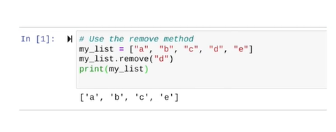
>
> ### `.append()`
> Adds input to the end of a list. 
>  Syntax: `<varable>.append(<value to append>)` \
> *Example:* : \
> 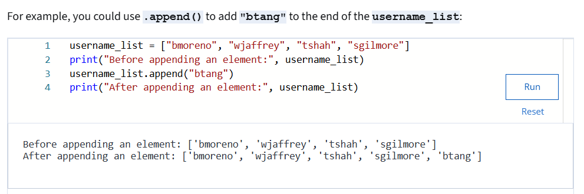
>
> ### `.index()`
> Similar to the .index() method used for strings, the .index() method used for lists finds the first occurrence of an element in a list and returns its index. It takes the element you're searching for as an input. \
> *Syntax*: `<variable>.index(<value to search for>)`
> *Example*:
> 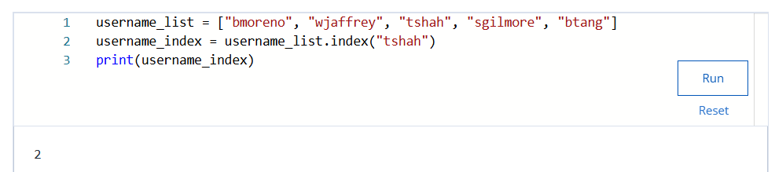
> 
> ## Algorithm
> A set of rules that solves a problem
>
> ## Regular Expression (regex)
> A sequence of characters that forms a pattern \
> - Need to `import re` for regular expression to work.
>
> ### Regular Expression Symbols
> #### `+` 
> Represents one or more occurences of a specific character \
> *Example*: \
> 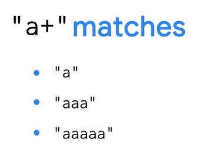
>
> #### `\w` 
> Matches with any alphanumeric character but it doesn't match symbols
>> **Note**: The \w symbol also matches with the underscore (`_`).
>
> *Example*:  \
> 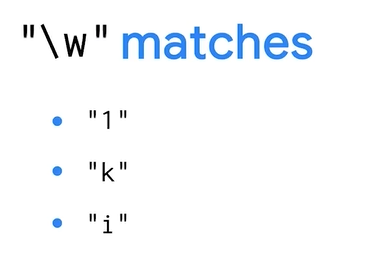
>
> #### Combining `\w` and `+` (`\w+`)
> 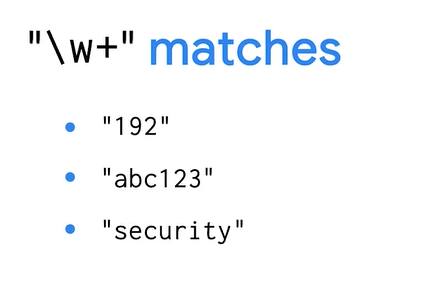
>
> 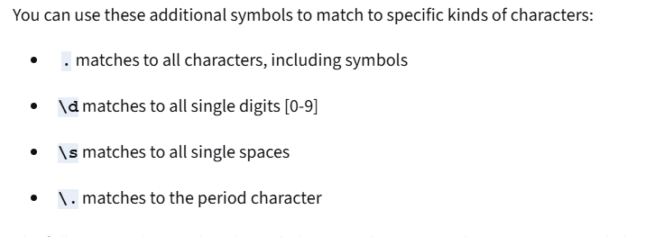 
>> The `*` symbol represents zero, one, or more occurrences of a specific character. 
>
> 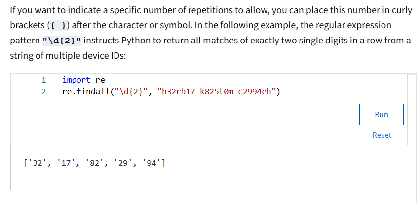 \
>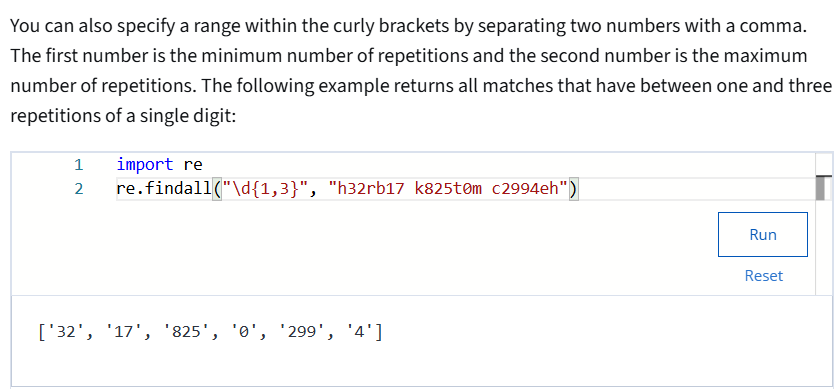
>
> ### `re.findall()`
> Returns a list of matches to a regular expression. \
> *Syntax:* `re.findall(<pattern>,<vairable to find pattern>)` \
> *Example:* \
> 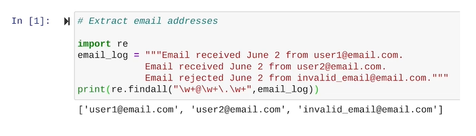
>
# Module 4
>
> ##  Why Automate Security Tasks in CI/CD with Python?
>
> - **Increases Speed and Efficiency:** Python scripts for security checks are fast and work well as part of your pipeline. This keeps your software releases quick and secure at the same time.
>
> - **Finds Problems Early:** Python can help find security problems early on when software is being developed. This makes problems easier and less expensive to fix. 
>
> - **Remains Consistent:** Python scripts make sure security checks are done the same way every time you build and release software. This lowers the chance of human error.
>
> - **Reduces workload  for Security Teams:** Python frees up security teams from repetitive tasks and allows them to work on  larger security problems, planning, or creating better Python scripts for security automation.
>
> - **Supports a culture or security:** Python-based automation helps put security into the CI/CD process. This helps create a DevSecOps culture where everyone thinks about security, not just the security team.