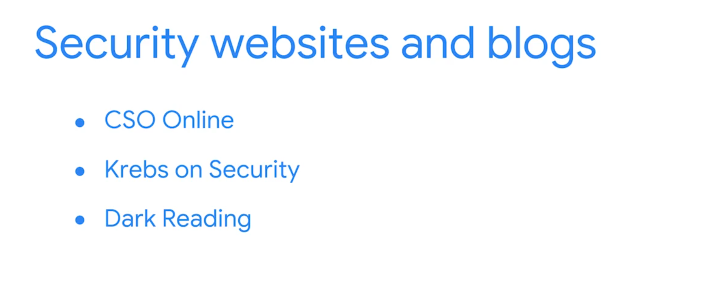

> ## Security Mindset
> The ability to evaluate risk and constantly seek out and identify the potatential or actual breach of a system
>
> ### Classifying for safety
>
> - **Public data**
> Public data is already accessible to the public and poses a minimal risk to the organization if viewed or shared by others. Although this data is open to the public, it still needs to be protected from security attacks.
>
> - **Private data**
> This data classification type has a higher security level. Private data is information that should be kept from the public. If an individual gains unauthorized access to private data, that event has the potential to pose a serious risk to an organization. 
> - **Sensitive data**
This information must be protected from everyone who does not have authorized access. Unauthorized access to sensitive data can cause significant damage to an organization’s finances and reputation. \
> Sensitive data includes personally identifiable information (PII), sensitive personally identifiable information (SPII), and protected health information (PHI).
>  
> - **Confidential data**
> This data classification type is important for an organization’s ongoing business operations. Confidential data often has limits on the number of people who have access to it. 
> 
> ### Asset classification
>  Asset classification means labeling assets based on sensitivity and importance to an organization. The classification of an organization's assets ranges from low- to high-level. 
>
> ## Business continuity plan
> A business continuity plan is a document that outlines the procedures to sustain business operations during and after a significant disruption. It is created alongside a disaster recovery plan to minimize the damage of a successful security attack. Here are four essential steps for business continuity plans:
>
> - **Conduct a business impact analysis**: The business impact analysis step focuses on the possible effects a disruption of business functions can have on an organization. 
>
> - **Identify, document, and implement steps to recover critical business functions and processes**: This step helps the business continuity team create actionable steps toward responding to a security event.
>
> - **Organize a business continuity team**: This step brings various members of the organization together to help execute the business continuity plan, if it is needed. The members of this team are typically from the cybersecurity,  IT, HR, communications, and operations departments. 
>
> - **Conduct training for the business continuity team**: The team considers different risk scenarios and prepares for security threats during these training exercises. 
>
> ## Disaster recovery plan
> A disaster recovery plan allows an organization’s security team to outline the steps needed to minimize the impact of a security incident, such as a successful ransomware attack that has stopped the manufacturing team from retrieving certain data. It also helps the security team resolve the security threat. A disaster recovery plan is typically created alongside a business continuity plan. Steps to create a disaster recovery plan should include:
>
> - Implementing recovery strategies to restore software
> - Implementing recovery strategies to restore hardware functionality
> - Identifying applications and data that might be impacted after a security incident has taken place 
>
>
> ## Incident Escalation
> Incident escalation is the process of identifying a potential security incident, triaging it, and (if appropriate) handing it off to a more experienced team member.
>
> #### Essential skills
> There are two essential skills that will help you identify security incidents that need to be escalated: attention to detail and an ability to follow an organization's escalation guidelines or processes
>
> ## Malware infection
> A malware infection is the incident type that occurs when malicious software designed to disrupt a system infiltrates an organization's computers or network. 
>
> - Unauthorized access: Occurs when an individual gains digital or physical access to a system, data,  or application without permission 
>
> - Improper usage: Occurs when an employee of an organization violates the organization’s acceptable use policies
>
> ### Levels of stakeholders 
>
> - **A cybersecurity risk manager** is a professional responsible for leading efforts to identify, assess, and mitigate security risks within an organization.
>
> - **A Chief Executive Officer**, also known as the CEO, is the highest ranking person in an organization. You are unlikely to communicate directly with this stakeholder as an entry-level analyst.
>
> - **A Chief Financial Officer**, also known as the CFO, is another high-level stakeholder that you’re unlikely to communicate with directly.
>
> - **A Chief Information Security Officer**, also known as the CISO, is the highest level of security stakeholder. You are also unlikely to communicate directly with this stakeholder as an entry-level analyst. 
>
> - **An operations manager** oversees the day-to-day security operations. These individuals lead teams related to the development and implementation of security strategies that protect an organization from cyber threats.
>
> ## Communication
> Stakeholders are very busy people. Your communication should be:
> - precise
> - avoid unnecessary technical terms
> - have a clear purpose
>
> As seniors/managers what stakeholders need to know.
>
> ### Communicate effectively with stakeholders
> #### 1. Get to the point
>> - What do I want this person to know? 
>> - Why is it important for them to know it? 
>> - When do they need to take action?
>> - How do I explain the situation in a nontechnical manner?
>
> #### 2. Follow the protocols 
>
> #### 3. Communicate with impact
>
> #### 4. Communication methods
>> - Instant messaging
>> - Emailing
>> - Video calling
>> - Phone calls
>> - Sharing a spreadsheet of data
>> - Sharing a slideshow presentation
>
> 
>
> 
>
>
> 
>
>
>
> ## Helpful Infomration for Technincal Interviews
> #### Python
> Python is a programming language that serves as an important tool in security, and you might be asked about it during a technical interview. It will be important to mention your basic knowledge of Python. You might recall from this program that Python is popular for its ease of use as well as its extensive libraries and integrations. It can be applied to various security tasks that require automation. During your interview, you might be asked to whiteboard a pseudo code in Python. Being able to confidently use Python terminology during an interview can help you stand out as a potential candidate. This will let the interviewer know that you have a solid understanding of what Python is and what it can be used for.
>
> ### General techniques
> During your technical interview, you might be expected to demonstrate basic knowledge of various general security concepts. For example, you might need to show familiarity with security frameworks, which are guidelines used for building plans to help mitigate risk and threats to data and privacy. When discussing security frameworks, it would be helpful to mention your knowledge of specific NIST frameworks, such as the Cybersecurity Framework (CSF). Another technical concept for you to discuss during a technical interview is network security. You might recall that network security is the practice of keeping an organization’s network infrastructure secure from unauthorized access. Reviewing the different technical concepts you’ve learned throughout this program is a good way to prepare for a technical interview. It will sharpen your skills and help you leave a good impression on the interviewer. 
>
> Additionally, it may be a good idea to write the entire question down on paper before answering. Often, technical interview questions have multiple parts to cover. People sometimes rush to give an answer and show their knowledge but not fully cover everything that the question asks. Writing down the question can help you ensure you have the question right and are able to provide a structured response. 
>
> #### Possible technical interview questions
Every technical interview will be different, depending on the company and the interviewers. But here are a few possible technical interview questions to help you prepare: 
>
> ##### - What is the TCP/IP model? 
> The TCP/IP model  is a framework used to visualize how data is organized and transmitted across a network. 
>
> ##### - What is the OSI model?
> The OSI model stands for open systems interconnection (OSI) model. It is a standardized concept that describes the seven layers computers use to communicate and send data over the network. 
>
> ##### -What are SIEM tools and what are they used for? 
> SIEM tools are security information and event management tools that are used by security professionals to identify and analyze security threats, risks, and vulnerabilities. 